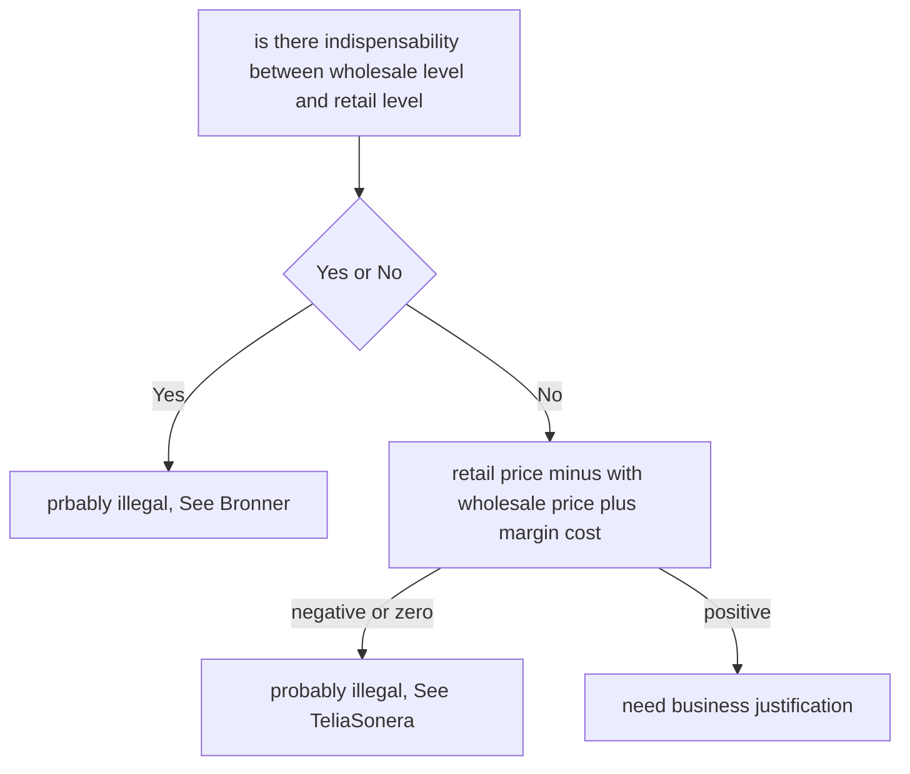

# Antitrust_Outline
This project is regarding the Antitrust outline made as of 2017, LL.M. antitrust class
Please use them only after request my email permission.
[Antitrust](https://github.com/Hanchor/Outline/blob/master/Anti-Trust.md)

# Economic & Anti-trust

[Antitrust]: https://github.com/Hanchor/Outline/blob/master/Anti-Trust.html	"Antitrust"

the theory of antitrust is somewhat antithetical. While the free market in the United States is designed to promote the impulse of businesses and individuals to grow as large nd profitable as possible, antitrust law is there to curb the naked greed that can ultimately harm competition. So, the goal of antitrust is t promote competition and not individual competitors. 

There is an alternate theory, however, that the antitrust law is also designed to protect consumers. Lately, there is Chicago school of thought that antitrust law is based on the goal of efficient utilization of resources (espoused by such luminaries as failed Supreme Court Justice nominee Robert Bork).

Much of this comes in the context of mergers, which ostensibly eliminates competition from the market. Agencies (See *jurisdiction, infra*) can operate from a position of presumptive unlawfulness, and have free reign to investigate mergers.

## 1. Demand Curve and Supply Curve

 
> The Supply Curve also affected by the _marginal cost_, which indicate the the change in the opportunity cost that arises when the quantity produced is incremented by one unit, that is, it is the cost of producing one more unit of a good.
> The *Total Cost* equals the *Fixed Cost* + *Variable Costs*.

As the demand curve showed. The output of a product (the market demand) will decrease if the price of such product increases. Similarly, through decreasing the availability of a product or service in the market, the price will correspondingly increase.

The problem, under antitrust law, is when the price of a good or service is artificially increased or, in the alternative, if the quantity of a good or service is artificially decreased.

1. The Supply Curve and the Demand Curve have to be intersected with each other to find out the _Q*_.
   Q*:  where the market demand is equal to the market supply. 

2. Where the Supply Curve and Demand Curve do not intersect, the market will collapse, and the chart will no longer exist.

3. If the Q1 < Q\*, **then the Price will be higher.** In this scenario, the consumer surplus will be reduced, and the producer surplus will increase. vice versa.

4. The purpose of economy is to **Maximum  both Surplus**.

   ​

## 2. Some Knowledge

#### 	2.1 Terms

| T                          | **Description**                          |
| -------------------------- | ---------------------------------------- |
| **Consumer surplus:**      | The excess money that people would pay over the competitive price for a good is called the consumer surplus. |
| **Inelastic:**             | A good for which the demand doesn’t change much even if the price changes. |
| **Competitive cost:**      | A consumer price that includes a reasonable profit for the business. |
| **Monopoly price:**        | The price a vendor can demand if that vendor has monopolized the market (read:some price higher than the competitive price). The monopoly price is where profits are maximized (anything higher would reduce consumer purchases to the point where none would buy). |
| **Reserve price:**         | The maximum price a consumer would be willing to pay for a good or service before either substituting another good or service or for going purchase altogether. |
| **Consumer surplus**       | The price some consumers would be willing to pay over the competitive price to obtain a good or service. In a certain light, this could be considered a foregone profit. |
| **Predatory pricing**      | Collusion between companies to drive out competition by lowering prices below cost and then, once vanquished, raising prices back toward monopoly prices. The problem, of course, is that other competitors could comeback into the vacuum |
| **Supracompetitive price** | Any price above the competitive price but below the monopoly price |
| **Market power**           | The ability of a firm to set prices or otherwise control a market. |

| T                            | Description                              |
| ---------------------------- | ---------------------------------------- |
| **Market definition**        | Set both by market share and geographic location. Narrowing the scope of geographic location and/or the relevant product market makes it more likely to find market power. |
| **Quick look analysis**      | A largely abandoned method to determine if a particular behavior violates antitrust law. Designed for violations that are not illegal per se, but are sufficiently anticompetitive on their face that a rule of reason analysis is not required. Places burden on the defendant to prove the action is not anti-competitive nor reduces quantity or increases price. No need for plaintiff to prove defendant has market power under the quick look analysis. |
| **Rule of reason analysis ** | Burden is on the plaintiff to prove that the actions of the defendant are anticompetitive, reduce quantity, or increase price; plaintiff also has to show the defendant has power in the defined market. |
| **Horizontal merger**        | A merger of competing companies.         |
| **Vertical merger**          | A merger of companies with complementary products |
| **Portfolio effects**        | In mergers, the anticipated effect of mergers between companies offering complementary products. Also referred to as “range effects.” The theory is that consumers often prefer to purchase a complete line of products from a single supplier. The proposed merger between Honeywell (a major aerospace equipment and instrument provider) and GE (the largest manufacturer of jet engines) was blocked on this basis. |
| **Entrenchment**             | The result of a firm benefiting from a merger’s portfolio effects, as itsolidifies its dominance in markets |
| **RPM**                      | Retail price maintenance                 |

#### 	2.2 Basic concept

1. simple monopoly and dominant firm does not means bad thing happened, they become dominant because of some reasons, which might be good reasons.

2. antitrust law more focused on anti-competition conduct that is used to *obtain or maintain monopoly or dominant market power*, at levels that were *NOT* able to obtain through productive efforts.

3. Three parts of anti-trust law:

   1. Vertical: Supplier - Producer - Consumer
   2. Horizontal: Seller - Seller - Seller
   3. Dominant market power: conglomerate mergers.

   > Oligopolistic Coordination
   >
   > when the market have few firms that each has an influence on price and output, can notice and respond to the action of each other. Even though there is no explicit agreement between these firms, they may be able to coordinate to restrict output and raise price.
   >
   > e.g. there are only two merchandises selling knife. they could modified their price to adjust with each other to restrict the price.

   ​

#### 	2.3 Source of market power

> From Wikipedia

​	A monopoly can raise prices and retain customers because the monopoly has no competitors. If a customer has no other place to go to obtain the goods or services, they either pay the increased price or do without. the key to market power is to preclude competition through high barriers of entry. Barriers to entry that are significant sources of market power are control of scarce resources, increasing returns to scale, technological superiority and government created barriers to entry. OPEC is an example of an organization that has market power due to control over scarce resources — oil. Increasing returns to scale are another important source of market power. Firms experiencing increasing returns to scale are also experiencing decreasing average total costs. Firms in such industries become more profitable with size. Therefore over time the industry is dominated by a few large firms. This dominance makes it difficult for start up firms to succeed. Firms like power companies, cable television companies and wireless communication companies with large start up costs fall within this category. A company wishing to enter such industries must have the financial ability to spend millions of dollars before starting operations and generating any revenue. Similarly established firms also have a competitive advantage over new firms. An established firm threatened by a new competitor can lower prices to drive out the competition. Microsoft is a firm that has substantial pricing or market power due to technological superiority in its design and production processes. Finally government created barriers to entry can be a source of market power. A prime example are patents granted to pharmaceutical companies. These patents give the drug companies a virtual monopoly in the protected product for the term of the patent. 

## 3. Economic Theory - viewpoint

****

When monopoly happens, the price goes high and the consumer surplus is reduced. the loss of consumer surplus is called "the deadweight loss (DWL)"

### 	3.1 Why Monopoly bad?

**monopoly increase the price and cause DWL, which is bad, since ecomomy seeks for the maximum of both consumer surplus and the producer surplus.**

#### 3.1.1 Counter arguments of the effect of DWL

* `Herberge` Deal with the DWL, the DWL is not that big and the consumer loss is not that significant. 

* `Posner` argued that when considering the DWL, we should not only count the loss of consumer surplus, but also count in the increased producer surplus. Since the monopolists will spend the surplus they earned not  to benefit the market, but to maintain their monopoly, raise the market threshold, which is also a loss of the market.

* `Romer` , on the other hand, thought the consumer surplus exists when there is monopoly. if we negate the exists of such monopoly, there would be even no any consumer surplus. Thus, the exists of monopoly at least stimulated market to create new goods, which means, provider of new monopoly, or so called innovation or creativity, is good,, since it created new consumer surplus.

* `Mike Potter` argued that the real  innovation should aim to decrease "marginal cost," which should expand a lot of surplus, what's more, the real innovation could ONLY happen in intense competition market. monopoly is bad since it would not create a competitive environment, thus, it could not create innovation.*

  ## 4. Statues

  #### 	Sherman Act (passed July 2, 1890) 

  * Sherman Act, Sec. 1, sentence 1:* Costs are(artificially, through contract or conspiracy) driven up and thereby a segmentof consumers are being deprived of the benefit of goods as fewer are beingtransacted for in the market.
    * You can’t violate section one unilaterally; at least two actors are required.
    * You can be liable both civilly as well as criminally. Fines and prison time could be the result.
    * Generally to prove a Section 1 violation you must show the defendant has market power.
  * Sherman Act, Sec. 2: *Every personwho monopolizes, or attempts to monopolize (dangerous probability of success,and yet fail to), is liable for violating the statute. Affirmative defenses arelisted in 2(c) through 2(e), the biggest is due allowance for cost (such asdelivery to smaller retailers who require greater service during distribution).
  * Sherman Act, Sec. 4(jurisdiction, who has standing): * Federal courts have jurisdiction, under common law the government could not bring acase, but now the government can. Any person can also bring suit.
  * Sherman Act, Sec. 7:* “Person”includes corporations.

  #### Clayton Act (passed 1914, amends Sherman Act)

  * Clayton Act, Sec. 2:

    * (a) No price discrimination except for valid business costs, sellers can still choose customers.
    * (b) FTC can prohibit price discrimination but the presumption is rebuttable
  * Clayton Act, Sec. 3: Forbids sellers from offering discounts on goods (**not** services) to obtainexclusivity; seems to trigger an automatic *Sherman Act Section 1 violation. This is the foundation for tying claims.
  * Clayton Act, Sec. 4: 

    * 4A: Anyone who is injured in cash or property by an antitrust action has standing to bring suitin district court and can recover treble damages. Prevailing plaintiff rule:You can recover attorney’s fees as well. 
    * 4B:Four year SOL. 
    * 4C(a)(1):State attorneys general have standing. 
    * 4C(a)(2):Treble damage awards are possible. 
    * 4D:Profits made through illegal overcharges can also be awarded. 
    * 4E:Court has discretion in apportioning damage awards. 
    * 4F:Feds and states can join cases. 
    * 4G: Sole proprietorships and partnerships are not classified as persons under the law and therefore have no standing. 
  * Clayton Act, Sec. 5: Successful state or federal case against a defendant can serve as *prima facia* evidence for private plaintiffs.
  * Clayton Act Sec. 7: Clause prohibiting mergers that promote monopolies; gives FTC jurisdiction.
  * Clayton Act Sec. 7A*: Prior to the passage of Section 7A through the Hart-Scott-Rodino Act, mergers could only be challenged after that had been transacted – the “unscrambling the egg”problem. Section 7(a) requires filing notifications by the transacting parties to the government and a waiting period for merger. Section 1 of the Sherman Act and Section 7 of the Clayton Act are ex post, whereas Section 7(a) of the Clayton Act is ex ante.

  **Note: **There is private standing within section 7, but no private standing under section 7(a) of the Clayton Act (only the government can objectunder section 7(a).

  If the acquirer’s value is greater than $200M, or worth more than \$50M but less than \$200M and have net sales or assets of greater than \$10M,then mergers are subject to federal notification. The parties have the obligation to notify and wait 30 days (this can be extended).

  * Clayton Act, Sec. 16: Besides money damages, you can also get injunctive relief. 

  #### Federal Trade Commission Act (passed 1914)

  Federal Trade Commission Act, Sec. 5: Permits the FTC to take pre-emptive steps to prevent antitrust violations (subject to judicial review, see *Brown Shoe,* infra). Covers “unfair methods of competition in or affecting commerce.” This reads broader than the Sherman Act,but Souter in *CDA* says that a violation of Section 5 of the FTC Act is the equal to a violation of Section 1 of the Sherman Act. In fact, Section 5 of the FTC Act is a superset of Section 1 of the Sherman Act. The penalties for violation of section 5 is outlined in sections (f) (\$10K for each violation of a commission order, of which there are always many) and (m)(1)(A), (B), and (C)which says the commission can commence a civil action with the same $10K per violating fine.

  #### 	Robinson-Patman Act (passed 1936)

  Prohibits price discrimination by sellers amongst consumers.Amended Section 2 of the *Clayton Act.* Seems to protect competitorsrather than competition, there is a growing chorus to repeal it.

  #### 	Hart-Scott-RodinoAct (1976)

  Contains a parens patriae provision that permits states to sue on behalf of neutral persons as opposed to only on behalf of corporations under antitrust law.

***

# **The Sherman Act** [1890] 

> **Section 1[multilateral]**: "Every contract, combination in the form of trust or otherwise, or conspiracy, in restraint of trade or commerce among the several States, or with foreign nations, is declared to be illegal."
>
> **Section 2 [unilateral]**: "Every person who shall monopolize, or attempt to monopolize, or combine or conspire with any other person or persons, to monopolize any part of the trade or commerce among the several States, or with foreign nations, shall be deemed guilty of a felony.
>
> **Section 4 [jurisdiction, who has standing]**: Federal Courts have jurisdiction. Under common law the government could not bring a case. Since the Sherman Act is long being recognized as a common law statute, this section gives them the standing. Any person now, could bring up a Sherman Act claim.

## 1. why the Sherman Act is so short? 

the Congress do not know what to do with the voice requiring them to establish anti-trust law, but they have to do something due to the mandate requirement. 

### 	1.1 the study of legislative history:

* `Letwin`, there is simple hatred of people and there is a mandate requirement ask the congress to make such law.
* `Thorelli`, the congress is trying to avoid adapting acadamic theory, and make the court to find out the best way to deal with the problem by using common law system.
* `Robert Bork`\*, discretion given to court to advancing consumer farewell and maximizing social welfare.
* `Lande`: Congress is trying to function Efficiency, and care about consumer.
* `Scherer & Ross`\*, the statute should make sure the market works, and monopoly is bad for democracy.
* `Sullivan & Warren`, the policy behind the statute is to preserve market rather than preserve democracy. "if you care about redistribution, do not go to anti-trust, since the redistribution might satisfy a large scale of efficiency."
* `Bork`, believe that this statute is designed with intent to support efficiency. Congress is smart at this point. 

##  2. Interpretation of Sherman Act

> Section 1[multilateral]: "Every contract, combination in the form of trust or otherwise, or conspiracy, in restraint of trade or commerce among the several States, or with foreign nations, is declared to be illegal."

#### 	United States v. Trans-Missouri Freight Assn (1897) P51 [US]

18 carriers west of the Mississippi who fix rates, rules and regulations for traffic, and so on. District Court dismisses complaint, affirmed by Circuit Court, makes it to SCOTUS.  

* Defendant's argument:
  1. their Action is not covered by Sherman Act, which is simply the codify of common law. In Sherman Act, "Every" does not means literally "every."
  2. their contract is reasonable, thus should be legal.
* Court's opinion
  1. Sherman Act covers "every contract," which should be interpreted as all contract. Congress had prohibited all contracts and combinations with the purpose of restraint of trade. That is the Sherman Act is actually boarder than common law.
  2. the reasonable ness is hard to be determined, and remains uncertainty, such uncertainty could not be formulated properly.
  3. Sherman Act is not simply coding common law. the Sherman Act does NOT only criminalized those contracts and combinations that were already prohibited by the common law, but ALL contract. The act previously was not construed to make new items unlawful that were lawful under common law, but instead to statutorily make unlawful those things prohibited under common law. 

  ​

  #### United States v. Joint Traffic Assn

> the effect of most business contracts or combinations is to restrain trade in some degree. However, Justice Peckham said that these covenant is not understood to be restrains of trade, as the term is legally defined.

* Defendant's argument: same as in Trans-Missouri case.

* Court's opinion [direct/indirect rule]:
  * The Sherman Act applies only to those contracts whose direct and immediate effect is a restrain upon interstate commerce.

    ​

  #### Standard Oil v. United States

Justice White again demonstrate it's "rule of reason" view. such opinion is the same as the "direct-indirect rule" in Joint-Traffic Assn.**

* The "All contract" should not be interpreted as literal all contract. But the Sherman Act should be interpreted based on common law.

* Every does not means every, the reasonableness should be considered.

  ​

  #### United States v. Addyston Pipe & Steel Co. (1898) P56 [US]

  Six pipe manufacturers entered into a horizontal agreement of two years’ duration under which they <u>divided sales territories</u>. 

* Defendant's argument:
  1. the contract should be justified as "reasonable":
     * without such contract, its members would subject to ruinous competition.
     * their contract do not exceed in degree of stringency.
     * the price determined in their contract is fair and reasonable,
     * competition between memberships and non-members (2 times than memberships) is also existed.
  2. it's necessary to have such contract, and such contract is unable to raise the market price [no actual effect].

* Court's opinion (Justice Taft):
  1. the language "all contract" should be interpreted under common law. restrain contracts would be OK, should it is ancillary to its main legal purpose.
  2. <u>a contract with its SOLE purpose is to restrain trade should not be deemed as a legal contract</u> even interpreted by common law system.

* Justice Taft's opinion is in the middle between Justice Reckham and Justice White.

  ##### 	Why Justice Taft's opinion is between Rechham and White ? and why it is important?

* Justice Rechham held: every means every;  |  Justice White held every does not means every, people should consider reasonableness.

* Justice Taft held:

  1. the sole purpose of this agreement is to restrain trade. Thus, the reasonableness is not mattered with this kind of agreement. 
  2. other agreements should apply the rule of reason.

* Justice Taft categorized all contracts into two classes:

  * ancillary effects is restrain trade;
  * sole purpose is to restrain trade.

  Such division made his opinion in the middle, in one category, every means every; in another category, reasonableness counted.

  ##### 	Why we should read Justice Taft's opinion?

1. he established a category to reduce the work load of judges, which increased the efficiency. A judge should not need to analyze every contract before them.
2. he created a framework that help judges avoid mistakes, a safe guide to judicial institution. In his opinion, he noted that judges may make mistakes since they are not professionals in business area (professional competence). Some kinds of agreement should avoid doing a lot of work; some requires deep thinking and understanding. 

***

# Restraints of Trade

The rule about the Restraints of Trade is generally divided into to parts: a. Based on Horizontal Agreement; b. Based on Vertical Agreement.

| Conduct involved              | Horizontal                              | Vertical                                 |
| ----------------------------- | --------------------------------------- | ---------------------------------------- |
| Non-Price                     | Depends (AP, essential)                 | Rule of Reason (continental)             |
| Min-Price Fixing              | *per se*                                | *per se* (Dr.Miles)  $$\rightarrow$$ Rule of Reason (leegen) |
| Max-Price Fixing              | *per se*                                | Rule of Reason (State Oil v. Khan)       |
| Suggested price (facilitates) | *per se* (quick look) (American Column) | Rule of Reason (BEC v. Sharp)            |
| Suggested non-price           | Depends ()                              |                                          |

***

#  Horizontal Agreement

When evaluating a horizontal agreement, use the following criteria:

* Is the conduct involved likely to have a substantial and direct effect on price; is that effect one that “necessarily” flows from the arrangement?
  * Manufacturers that entered into an agreement to make pasta with only 50% of drum wheat as opposed to 100%. This can be viewed as quality adjusted price, similar to Hershey effect (bar is always 1 dollar but the size of the bar varies)
  * Beer wholesalers made an agreement to no longer offer favorable credit terms to creditors
  * Leading grocery stores agree with each other to stop offering double-coupon promotions.
* Are there likely to be substantial redeeming virtues flowing from the practice or conduct?
* Could the same or similar redeeming virtues be achieved through reasonably available and less harmful alternatives?
* How difficult would it be to explore relevant considerations, i.e., what will the costs be in terms of transaction costs and future uncertainty with respect to the legality of categories of business behavior and thus the effectiveness of the rule?

***

* *Per se* rule:
  * in the category of pure purpose for anticompetitive effects, which means the agreement is not a ancillary agreement to the main legal conduct.

  * Requires the scrutiny of pure purpose.

    > if the plaintiff proves the defendant as taken such actions, the case is essentially over. There are very few “pre se” violations remaining, most cases require a rule of reason analysis (pro/anticompetitive, increase/decrease in quantity, increase/decrease in price). Courts adopted the per se rules in an effort to achieve judicial economy.
* Quick look
  * in the area, where courts have some knowledge in, the court could have a quick look at the purpose of the agreement and its procompetitive side to decided whether should apply the per se rule.
* Rule of reason
  * the court should balancing the procompetitive effect of the agreement and the anticompetitive side of the agreement.

    > “When you are performing a rule of reason evaluation, look at the purpose as well as the effect.” – *Brandeis, Chicago Board of Trade*

    The “rule of reason” is the approach that courts take generally when the effects of a particular restraint are not immediately obvious and require and full-blown market analysis. There is no hard and fast set of rules; literally everything is on the table.

    Unreasonable is defined by reducing quantity and raising price; if this standard is not met, then the restraint is per se reasonable. 

    * There are per se violations (e.g., price fixing), that even though they don’t increase price/reduce quantity they are still regarded as a violation. At this point, the reasonableness standard does not need to be met and the government through proving the action, has proven its prima facia case.

    Reasonability depends upon whether the restraint promotes or undermines competition. If the former, then the restraint is reasonable; if the latter, then it is unreasonable. What ultimately matters is the restraint's effect. A restraint's ostensible or actually intended purpose is relevant only insofar as it sheds light on the restraint's effect. What sort of effects would be anti-competitive? Justice Brandeis, in Chicago Board of Trade (infra) identified higher prices and lower quality as examples of anti-competitive effects.

    ​

## 1. Price-Fixing

Price-Fixing cartel is bad for the same reason as monopoly. When several merchant come together and set for a fixing price, they collectively act as monopoly, function as monopolists.

#### United States v. Trenton Potteries Co. [US] *per se*

> Uniform price-fixing by those controlling in any substantial manner a trade or business in interstate commerce is prohibited by the Sherman Law, despite the reasonableness of the particular price agreed upon. ___ the per se rule should be applied.

* Judges are uncertain about the reasonableness in business area. and for part of efficiency consideration, judges should "not adopt a construction making he difference between legal and illegal conduct in the  field of business relations depend upon so uncertain a test as whether the prices are reasonable."

  ​

#### United States v. Scony-Vacuum Oil [US] *Footnote 59* *per se*

Socony was a fully integrated petroleum firm, owning everything from the wells to the pumps, and in its geographic market (Mid-Western States) sold 83% of the gas. Socony coordinated two separate campaigns to fix the price of gas, buying “distressed” gas on the spot market to preserve its position. SCOTUS found sufficient market power on the part of Socony to essentially fix the price of retail gasoline through setting an artificial floor.

* Defendant argument:
  1. there are reasons why they need to fix the price, which is reasonable.
  2. the agreement actually do not effect the price national wide.

* Court's holding: We do not consider whether the price fixing is reasonable or not. Fixing price itself is anti-competitive.

  ##### 	Footnote 59 - price fixing is per se illegal

* It is the contract that the law strike down; not the reasonableness, it does not matter whether an effect actually showed up. 

when competitors come together and fix price, if they argue their price is reasonable, it does not matters, the agreement is per se illegal.

> Footnote 59 is also called the prosecutor's bible, a prosecutor only need to find out the existence of the agreement on price to suit someone.*

All these arguments are irrelevant: 1. reasonable price; 2. could not effect market price; 3.if not do so, company will go bankruptcy (it is necessary for the company to survive).

#### 	

#### Enforcement of anti-trust law

* Civil: joint and several.

  * The last one to report will be punished for the whole damage, while the first one to report will be remitted.

  ​

#### Broadcast Music, Inc. (BMI) v. Columbia Broadcasting system [US] *rule of reason*

>  Though there is a fixed price. This case used the rule of reason.

composers jointly license their rights to a collaboration. and the BMI sold the access to the entire compositions in a certain price.

When determine whether the per se rule should apply: 

1. the court first see if the agreement plainly (naked) for anti-competition purpose.*

2. if NOT, the rule of reason would apply. the court should weighting the balancing between the procompetitive effect and the anticompetitive effect.

   ​

##### Reason

1. Court do not familiar with such market so the supreme court could not determine whether such conduct is a must anti-competitive one
   * the <u>blanket license</u>(a license for accessibility to massive product) arose out of **Practicality**. Thousands of users and composers in the market place want a reliable way to collect for the use of their copyrights. It is an integration necessary to achieve efficiencies. "the whole is greater than its parts."
   * the <u>blanket license</u> is a **different product** compared to the individual license.
2. When balancing the procompetitive effect and anticompetitive effect. the BMI product mitigated the cost; consumer would like such product; and the product is user friendly.
   * the source of blanket license is not exclusive license. Thus, the Plaintiff could actually chose from individual license or the blanket license from the Defendant.
3. The new product is a reasonable necessary way to use massive property.*

##### RULE

1. all agreement on price is NOT per se illegal.

2. if an agreement's sole purpose is NOT to restrain trade, the rule of reason should apply, which balancing the procompetitive effect and the anticompetitive effect.

3. the more you could create a new product, the more likely you could prove a procompetitive effect.

   ​

#### Arizona v. Maricopa County Medical Society [US] *per se*

doctors come together for an agreement that every doctor should not prescribe any bill higher than the insurance of patients. which <u>scheduled a Maximum price</u>, which the doctors thought is good to consumer.

* the defendant's argument:
  1. they limited the maximum price, which is good for consumer.
  2. Judges do not familiar with this business area, the court should apply rule of reason.
  3. they actually created efficiency for insurance company, and it's reasonable. the insurance company could bear a limited risk of being charged massive medical fee, which would also save patients millions of dollars.
  4. their product just like BMI.
* the court held:
  1. by agree to the maximum price, there still exists anticompetitive effect. it created higher threshold, making new entrance harder. Secondly, by fixing the maximum price, they do not allowed difference in providing different quality. Thirdly, for the agreement, once it established, every doctor now could satisfy it, it's not necessary.

     > <u>Price floors</u> and <u>price ceiling</u>s may have different consequences economically, but price ceilings still have anticompetitive effects, as they may severely intrude upon the ability of competitors to service in the market, discourage training and innovation. 

  2. The efficiency for insurance companies has no stands. There are other ways to enhance insurance companies' efficiency, the arguments here could not support the the defendants' argument. The goal of these doctors are ultimately to affect prevailing market prices.

  3. it's not necessary for the court to understand every business at the very beginning. They could learn the business involved when the trial started (the quick look). if they have enough knowledge and confidence, they could apply per se rule, after a so-called "quick-look". a quick-look do not need to go to trial to collect massive evidences.* What's more, the economic analysis for medical profession (as well as other profession) is basically the same as for business in general.

  4. the congress authorized the court to interpret Sherman Act, and court has long interpreted in this way. if the defendant thought the interpretation is wrong, they should find the congress to modify the statute into more specific way.*

  5. The defendant do not created a new product. the Doctor Association does not have a pooling of capital, and they do not share risk. every doctor doing business for their own benefit. they are not a single entity. 

  6. the price fixing in BMI is necessary consequence of the blanket license, the products that also create efficiency and consumers like. Here, the situation is different.

     ​

#### Texaco v. Dagher (Form a new joint venture) [US] *legal*

Texaco and Shell Oil formed a joint venture, Equilon, to consolidate their operations. but the Equilon sell oil under original two brand, under a same price.

* the court held that this is the price that settled by a single entity, and it's not a  pricing agreement between two competition entities with respect to their competing products. the challenged business practice involved the "core activity" of the joint venture, thus, the ancillary restraint doctrine should not apply.
  * The per se rule against price-fixing should not be applied when there is no competition between competitors. The price agreement must be an agreement between separate competing entities. The "internal pricing decision of a legitimate joint venture" is not under the scrutiny of Sherman Act as long as it remains with the companies' business plan.

##### What's the takeaway from Dagher compared to Maricopa?

Whether section 1 of Sherman Act should apply. One should ask whether there is a pooling of capital and sharing of risk, *to wit* whether it is a single entity.

#### American Needle v. NFL joint ventures [US] *quick look*

American Needle Inc. filed suit in an Illinois federal district court against the National Football League ("NFL") and Reebok International Ltd. alleging that the teams' exclusive licensing agreement with Reebok violated the Sherman Antitrust Act. American Needle argued that because individual NFL teams separately own their team logos and trademarks, their collective agreement to authorize NFL Properties to award the exclusive headwear license to Reebok, was in fact a conspiracy to restrict other vendors' ability to obtain licenses for the teams' intellectual property.

* Ct. the NFL and its members are not a single entity for the purpose of antitrust law
  * Based on functionalism. If withiout the alleged agreement, the actors would still act in the same way because of common control diverge in the economic interest and they might be treated as one. However, here, if there is no such agreement, the actors would diverge in economic interest and they are treated as separate entities.
    1. The joint ventures are subject to ongoing control by team members and have their own independent management and economic interests; and
    2. the ongoing ability of those decision makers to unilaterally compete in the relevant market. 
       * Ct. 1 is not disproven merely because there is collective economic interest. What matters is that the entities retain some separate control and interests. 
       * 2 is satisfied, and satisfied when showed that members potentially could potentially compete in the same market with the same products. the teams still own their own trademarks and are free to license those trademarks and are free to market them after the 10 year exclusive licensing agreement is up. They are therefore potential future competitors.
* Rule of reason standard is applied. There are some specialties in sports market, <u>A degree of cooperation between the teams can be used to demonstrate that it is necessary for the market to be preserved/ necessary to market the product to all</u>. Or that maintaining a collective balance among athletes is legitimate and important. 
* <u>Facially procompetitive effect of the joint venture</u> would justify a less detailed analysis than rule of reason would otherwise require. **Quick look applies**
  * Suggests that if conduct is necessary for the venture’s product’s availability at all, the conduct of joint venture will likely survive RR under quick look doctrine. 
* American Needle cuts back on Dagher. Dagher is about the right standard to apply to the agreement, while American needle is about whether the agreement exists. 

## 2. Output Restrictions 

#### NCAA v. Board of Regents of Univ. of Oklahoma [US] *quick look*  P249

> agreement on maximum output

University of Oklahoma alleges it is harmed by the NCAA restriction limiting the number of college football games that appear on television by prohibiting schools from negotiating their own broadcasting rights. These school sports team gain together make sure no much school gain much more money because of the disposure. the association allege that such agreement also could enhance live-game attendance.

* Defendant's argument:

  1. when it comes to sports, some restrictions are necessary. Thus, we have to use the rule of reason scrutiny.
  2. the agreement could enhance efficiency, it's a new product and just like BMI, it did not prohibit negotiation with individual teams.
  3. the agreement created more live-game attendance and equality.

* Justice Steven:

  > the per se rule and the rule of reason are actually the same rule. they all needs some degree of balancing, compare consequence of procompetitive effect and anticompetitive effect.*

  1. The NCAA restrictions should not be applied *per se* rule. When some horizontal restraints are necessary to joint venture product to be available at all, it would remove all restraints from per se analysis. 
     * Here, no new product is produced, unlike BMI, the methods in argument is not efficiency, the business is something could negotiate with individuals, and there is no necessary to create a cartel to handle such thing (comparing to BMI, where it would be impossible to contact individual composer since there are too much of them).
     * But at the first look, some limitations should be there, or there will be no NCAA game.
  2. For the function of advance live attendance, there is no such data support the defendant's argument.

* Under the <u>quick look analysis, there is no need to prove market power</u>, as there are actual harms to competition (higher prices and lower output/ many more games would be televised if not for this restriction). 

  ​

#### Synthetic Fibers [EU] P130 *like rule of reason*

> When market force fail, the horizontal restriction is necessary for the product to exist at all

There is a limited duration agreement between manufacturers in the synthetic fibers industry to limit output and capacity in order to stabilize prices in a market that is over capacitated. The overcapacity is the result fo rapid technological advances and demand trend that has failed to rise as expected. 

* Rule of Reason applied when market forces have failed and not induced the actions necessary to save an industry.
* Does consumers stand to gain?
* Is the planned arrangement indispensable to the objective in view, i.e. restoring the capacity at a level that is more economic. 
* Does agreement eliminate competition for substantial part of the products in question. 

## 3. Market Division

* market division is worse than price fixing, price fixing only eliminated the competition on price. However, market division ends the competition in such area completely.

#### Palmer v. BRG

the judicial bar review business. There is a horizontal agreement between HBJ and BRG for BRG would have exclusive license of HBJ materials in Georgia. BRG would exist Georgia market, and HBJ would exit the market outside of Georgia/market division. Prices for courses rose shortly after the agreement. <u>It would not matter whether there was previous competition in the market.</u>

##### What's the difference between licensing exclusive rights to others and divided the market by oneself ?

* Three categories in this business mode

  1. Company A license company B, and C, but compromising that A would not license anyone else in their business area, nor does A would participate in the business. [OK since of horizontal agreement]

     ****

  2. Company A license company B, and compromise it would not license anyone else in that area. Company A would conducting business in areas other than B does itself. [Ok, see *General Electronic*]

     ****

  3. Company A and Company B are competitors, and then Company A moved out of the territory, giving company B exclusive rights of its materials and compromise will not conduct business in such area. (Palmer case)

  ****

* Obviously, the licensing agreement is fine, so courts here are struggling in distinguish licensing agreement and market division.

##### Rule

* Agreement amongst competitors on market division is per se illegal.*
  * if you started analyzing purpose and effect, you at least going down to "quick look," which is like rule of reason.
    * The anticompetitive impact is the price increase for consumers, with no lowered transaction cost, no new product, and no potential efficiencies
  * the prior competition relationship is NOT a critical prerequisite here.
    * if two companies has no prior competition relationship, e.g. they originally separately doing business in two territories, and then they latter signed up a contract agreed that each of them would not participate in others' territory, it is still a market division even without prior competition history.
    * However, the court said that if Barbri licensed products for Palmer to sale, and never entered into the Georgia market, it would seem legit. Just a bit of change of facts seem to come to different results. So it is hard for the courts.  

#### Soda-Ash v. Solvay [EU]

the EU law is the same with the U.S. law in the horizontal market division. However, the EU market concept is different with the U.S. law. EU consider the market under the basement of "Common market."

> Arrangements between producers which have the object or effect of protecting national markets are expressly prohibited. Such production is in fundamental conflict with one basic objective of roman treaty. 

Prior competition is not necessary to establish the per se rule. Horizontal agreement is.

> In vertical agreement, the EU law is somehow different with the US law.  

## 4.Boycott (Horizontal refuse to deal & joint venture)

H<u>orizontal group boycott is per se illegal</u>. the test could be "purpose, tendency test." (See *Fashion Originators*) However, the vertical boycott does not apply the per se rule, but a full of reason analysis must be done. (See *Nynex*)

Group boycotts, in which ostensible competitors refuse to deal with one or more other firms, are a violation per se of Section 1 of the Sherman Act. 

* Unilateral refusals to deal are defensible (this is till undergoing evolution), but concerted (group) refusals to deal are prohibited.

#### Klors' Inc.(1959) P154  [US] *per se*

a group of retail stores, upon agreed with one of Klors' competitor, refuse to deal business with Klors'. 

Common law prohibits contracts that interfere with the natural flow of an appreciable amount of interstate commerce. Such acts cripple the freedom of traders and thereby restrain their ability to sell in accordance with their own judgment. Group boycotts are a step towards establishing cartels that will lead to eventual harm to consumers. 

> This is not a case of a single trader refusing to deal with another, nor even of a manufacturer and a dealer agreeing to an exclusive distributorship. alleged in this complaint is a wide combination consisting of manufacturers, distributors and a retailer.

> This is a case which viewed in horizontal level. There are other cases reviewed in Unilateral Conduct & Vertical Agreement.

#### NYNEX v. Discon [US] (verdical) *legal*

NYNEX chose to use a wholly-owned subsidiaries for removal work performed in its central offices, even though they were charged more for the work and passed the additional costs onto consumers, instead of Discon plaintiffs. NYNEX owned all named defendants in the case. Although the behavior of NYNEX was egregious (cover-ups, etc.), because it was a single-purchaser/single-supplier issue, no antitrust violation was found. Vertical agreements that deprive a supplier of a potential customer is not recognized as a per se violation. 

* This is a vertical agreement. thus, the per se group boycott rule does NOT apply.*
  * a plaintiff itself must allege and prove harm to the competition, instead of to a single competitor. The Sherman Act does not protect any single competitor, but competition itself. Thus, not to deal with a single competitor is not a standing.
  * a vertical restraint is not illegal per se unless it includes some agreement on price or price levels. (see Business Electronics)
  * the freedom to switch suppliers lies close to the heart of the competitive process that the antitrust laws seek to encourage.

#### Fashion Originators' guild of Am. v. FTC [US] *per se*

> Guild found to have market power (60% of certain US markets)

the creators in this case is a group of designers, they created a horizontal agreement not to deal with some small retailers to prevent their <u>un-copyrighted products</u> being sold in a lower price. The Guild forged a members’ agreement to not sell their fashions to stores that also carried knockoffs of their designs.

Defendant arguments that prices were not fixed nor production limited discounted. Court found nothing in federal law to protect designers from the freeriding of design pirates (perhaps a theory of tort under state law).

* since this is a horizontal agreement boycott, it is per se illegal. 
  * Unlike BMI, here, no new product is created, they are more like a collaboration (just like neighbors come together to hire a police officer)
* Here, since these products are not copyrighted, there is no IP law involved.

#### Pre-Isolated Pipe cartel [EU]  P161

[The EU law are the same with the US law here]

Cartel members that made district heating pipes asked only substantial non-member powerpipe to stay out of German market. Powerpipe refused. Cartel retaliated by refusing to supply component parts that Powerpipe did not make to P customers, and pressured suppliers of plastic not to supply Powerpipe. 

* Commission found that the goal to eliminate the competitor by refusing to supply parts constituted an infringement of Article 101(1). 
* <u>The agreement is the one between producers.</u> 
* Ct.: all we have in this case is a naked agreement to boycott power pipe cartel. A naked boycott is per se illegal.*

## 5. Boycott - joint venture

#### Terminal Railroad Ass'n P162 [US] 

> Twenty-four lines of railway converge at St. Louis. The cost of construction and maintenance of railroad bridges over the Mississippi River is so great that it is impracticable for every railroad desiring to enter or pass through the city to have its own bridge. The fourteen railroads owning the TRA control about one third of the railroad mileage of the United States. They agreed that no additional railroad could become a member of the TRA except by unanimous consent of the existing member railroads.

a group of terminal railroads company formed a association, controls the only way to get into St.Louis. they have a horizontal agreement to leave competitor out of such association, by giving veto power to a party. The S.Ct. said the association is OK, since like BMI, it create efficiency, but the association's bylaw have to be changed.

* since it's impossible to let every company build their own railroad (which means a huge cost), the now existing railroad **(a facility) is very Essential** to all railroad companies to conduct business in St.Louis.
* mere combination is not a problem, but the associations have to let other people, even competitors join the pie.
* the "essential" thing here is the facilities, the bridges, you should let people in to share such "Essential" thing.
  * the Essential thing is not something only efficient, but something essential, something people must have or may cause the one expelled dead.*

DOES the antitrust law go too far?

> the combination of two or more mere terminal companies into a single system does not violate the prohibition of the statute against contracts and combinations in restraint of interstate commerce, it is because such a combination may be of the greatest public utility.

#### Associated Press

> Associated Press (AP), an organization that gathered new stories from its members (newspaper publishers) and distributed the news stories to its members, on a nationwide and international basis. AP's by-laws prohibited supply of AP news to nonmembers, prohibited members from furnishing news to nonmembers, and allowed existing members to veto membership applications of competitors. 

newspaper presses formed a union to share new, they also involved a veto power to their partner, which makes them able to veto their competitors. Since the information exchange, the news exchange, regulated by the association is almost essential to press companies, such horizontal agreement is illegal. 

* As in the Terminal R.R. case, a combination among actors agreed to impose the restriction. That fact, as well as the Court's statement that <u>AP's news was not indispensable, made the case not a pure essential facilities § 2 case.</u> 
* AP, also created some efficiency, thus, the per se rule should not be applied. the rule of reason applied, and the court found AP's rule is not OK.
* The court  found during rule of reason that AP <u>unduly hindered the free flow of commerce in the channels of interstate trade</u>.
* **If powerful not necessarily dominant interests combined to prevent others from obtaining a valuable though not essential service for the purpose of limiting competition, <u>injury to the public</u> is conclusively presumed.** 
  * This element involved in the public interests on newspapers, since the newspapers are the resource of voice during that time. Being disseminated widely is the requirement of democracy. Thus, all newspapers bear the public interest of helping democracy.

##### Q: Why AP different from Power pipe?

1. AP case has some of efficiency/procompetitive aspect comparing to power pipe is a pure naked agreement.
2. under rule of reason, AP preclude someone from something essential without a enough good reason.

##### Q: what is special of AP? Maybe "social welfare justification ?"

* In AP, the product involved is newspapers. At that time, the newspapers and other publishes are ways people demonstrate their opinions. The distribution of newspapers then naturally connected the product with <u>the democracy system</u>. [link to *Lorain Journal*]

#### Northwests Wholesale Stationers v. Pacific Stationery (1985) [US] *legal*

> Northwest was a cooperative buying group which purchases supplies wholesale and sells to members and non-members at the same prices, but distributes profits to members in the form of a percentage rebate on purchases. Pacific was a member who was both a wholesaler and retailer, permitted to operate as both through a grandfather clause, until Pacific failed to notify Northwest of a 1977 change of control and was expelled by vote in 1978 without any due process. Pacific alleged that this was a concerted refusal to deal that was per se illegal under Sherman § 1

Northwest wholesale stationers permits the participating retailers to achieve economies of scale in purchasing and warehousing that would otherwise be unavailable to them. Upon Pacific failed to report its change of controlling powers, the Northwest expelled Pacific.

App. Ct. held that there is no due procedure to fire Pacific. Pacific is not procedural protected so should apply per-se rule (WRONG)

* The Court ruled that “group boycotts” are actually a category likely to have predominantly anticompetitive effects and procedural protections or the lack thereof are irrelevant to anticompetitive effects. <u>Without market power, no plausible efficiency justification, or exclusive access to essential elements, mere allegation of a concerted refusal to deal is not per se illegal</u>.

* every business contains some level of commercial restrains. Whether it violated the Sherman Act depends on whether it is adjudged an unreasonable restraint.
* This case is more like BMI, NCAA, where the arrangement of Northwest is meant to creates efficiency, at least should apply rule of reason.
* the absence of procedural safeguards can in NO sense determine the antitrust analysis.
  * the bylaw make sense, some regulation for the joint venture is needed.
  * Northwest did not cut off access to supply or essential facilities, did not dominate the market, and did not lack plausible efficiency justification

##### Q: What's the different between Northwest and Powerpipe

1. NW has something good, created efficiency, lowered the cost. comparing to power pipe which is a naked agreement.
2. NW is actually a small group. it occupied small market share and could not kick Pacific, the big guy, out of the market exclusively.

#### Joint venture case - functionally analysis:

> 1. how hard it is to enter;   2. is the joint venture dominate the market?

#### ANSEAU (EU)

a products sold in Poland is cheaper than Germany. so people in Germany would go purchase in Germany and sold in Poland. (parallel importation.) ANSEAU grant label A in Germany qualified products, and in Poland they are not labeled to prevent import.

like AshSoda, ANSEAU just created a wall that not exists (the examination). This behavior is not OK.

> the Wall is that the defendant asserted it would increase a lot of administrative cost if they have to go to Poland to test the product.

## 6. Professionals regulation 

A professional could not argue that competition is not good for their market, since the Sherman Act assume that competition is good for economy.

* **Goldfarb**: prescribe minimum fees for legal services. The court held that learned professions are still be covered by the Sherman Act, and prescribe minimum fees is a cartel price-fixing conduct, it is not OK.*

  > There is nothing to suggest that the Sherman Act was meant to provide a sweeping exemption to an entire profession regardless of what other not-for-profit purposes the profession may have.

* **National Society of Professional Engineers v. US**: The ethics rule requires all engineers not to negotiate price until client has selected the engineer for a particular project, and all other elements have being discussed. The court said that such conduct is not OK since it restrained the price negotiation. As for the argument that negotiate price before other agreements being settled will cause damage to the quality, the court did not accepted that. 

  Petitioner defended on the ground, inter alia, that, under the Rule of Reason, the canon was justified because it was adopted by members of a learned profession for the purpose of minimizing the risk that <u>competition would produce inferior engineering work endangering the public safety</u>.

  While ethical norms **MAY** serve to regulate and promote competition in professional services, and <u>thus fall within the Rule of Reason</u>, petitioner's argument here is a far cry from such a position; and, although competition may not be entirely conducive to ethical behavior, that is not a reason, cognizable under the Sherman Act, for doing away with competition.

  > Market restrictions that are related to the safety of a product may be upheld if they have no anticompetitive effect and that they are reasonably ancillary to the seller’s main purpose of protecting the public from harm or itself from product liability.
  >
  > ​	Here, they have anticompetitive effect since they limited the negotiation on price.

* **FTC v. Indiana Federation of Dentists**: refuse to deal on particular terms with patients covered by group dental insurance, refuse to provide X-ray information to insurance companies.

  Evaluated under the Rule of Reason, the FTC's factual findings are sufficient as a matter of law to establish a violation of § 1 of the Sherman Act, i.e., an unreasonable restraint of trade, Respondent's x-ray policy takes the form of a horizontal agreement among its members to withhold from their customers a particular service that they desire. Absent some countervailing procompetitive virtue, such an agreement cannot be sustained under the Rule of Reason. This conclusion is not precluded by the absence of specific findings as to the market in which respondent allegedly restrained competition or as to the power of respondent's members in that market, or by the FTC's failure to find that respondent's x-ray policy resulted in more costly dental services than the patients and insurers would have chosen if they were able to evaluate x-rays in conjunction with claim forms. Nor do alleged noncompetitive "quality of care" considerations justify respondent's x-ray policy. And whether or not respondent's policy is consistent with Indiana's supposed policy against submission of x-rays to insurers, it is not immunized from antitrust scrutiny.

  * The court did not look at market power of dentists because they found the restraint to be naked and restricts the free flow of information, therefore is anticompetitive. NCAA. There must be some competitive justification. 

* **California Dental Ass'n v. FTC**: when advertising price, no vague language should be used. - created economic benefit, like BMI, its OK.

  Two issues in the case: 

  * Does the FTC have jurisdiction over non-profit professional organizations (they do) and 
  * is “Quick Look” analysis sufficient to determine if the limitations on advertising enforced by the CDA are a violation of antitrust law (it isn’t). 

  Plaintiff’s advertising restrictions could credibly have a net precompetitive effect or possibly no effect at all on competition.  The obvious anticompetitive effect that triggers abbreviated analysis has not been shown.

  * <u>Essentially the death of the Quick Look</u>, as the court held that if a practice is potentially pro-competitive, then a full-blown market analysis is required and the plaintiff has the burden to show that the restraint is anti-competitive. Often this means having to show that the defendant has “market power” - i.e., the ability to profitably raise price above competitive levels.
  * <u>Quick look should only be applied when the conduct is not per se illegal but nevertheless appears obviously anticompetitive,</u> in situations where there is a large possibility of anticompetitive effects can be ascertained

  There are dissents about this case, where questioned who should bear the proof.

* **FTC v. Superior Court Trial Lawyers Ass'n**: raise price for trial lawyers or refuse to deal. it is not a 1st amendment case. (many conducts have the meaning of demonstrating one's voice, this is not )

  Respondents' boycott constituted a horizontal arrangement among competitors that was unquestionably a naked restraint of price and output in violation of the antitrust laws. Respondents' proffered social justifications for the restraint of trade do not make the restraint any less unlawful.

* **Wouters E.C.R**: lawyers could not partnership with accountants; OK since there is requirement for independence.

  #### 	Conclusion

it is noticed that, as to the learned professionals. The ethics rules are necessary since only professionals know how to regulate their job performance and to prevent their market failure. Ethics rules helped to sustain the market, since if there is not such rule, the trust may be broken and the market will fail.

Rule of reason would be better since it would help judges to prevent professionals from abusing their power. The court should pay attention when the professionals themselves said that there are market failures.

## 7. IP related

#### General Electronic (also the EU law)

> the patentee may impose any condition in a manufacturing license that are <u>normally and reasonably</u> adapted to secure pecuniary reward to patentee's monopoly.

A general license structure is fine, even though it's exclusive license. The existence of such license is one way to grant GE the reasonable and normal profit they deserved.

If such exclusive license is illegal, then no one in the market would use license structure. a non-license market is worse than exclusive license. 

****

#### New wrinkle

two companies put their license together creating a new entity to produce goods, to fix the price is illegal. the so-called "patent pool company."

* purpose: to establish minimum prices throughout the industry. such agreement would give new winkle a dominant market power. Thus, this is a <u>naked agreement</u>.
* cross-licensing was barred as beyond the patent monopoly.

##### Q: what's the difference with BMI?

Here, no purpose to create a new product, but to create monopoly.

#### Spril Louis Erauw-Jacquery v. La Hesbignonne Sc., 1988 E.C.R. 1919

Like GE, the rule is almost the same

## 8. Buyer Cartels

fixing purchasing price is also per se illegal

# Inferring A Horizontal Agreement

## 1. Parallel Conduct

> In an oligopoly system, the phenomenon that different sellers charging the same price might be a result of economy development. The market itself will drive the price of same product to reach the same point.
>
> **___ `Tuner`**

> The Tuner's theory made too much assumptions. 
>
> 1. Even the market may drive different seller to change their selling price to the same one, there would be time log between these changes. The time log comes from the face that companies need time to make changes;
> 2. different companies have different capacities, small companies may hesitate to change their price since they are uncertain about upcoming response. 
> 3. Tuner's theory did not estimate the new entrance;
> 4. when one company increase its output, it did not have a significant impact on its competitors to force them comply with the initiator.
> 5. it would be really hard to maintain a supracompetitive price.
>
> **___`Donald Posner`**

#### Interstate Circuit v. United States [Parallel Behavior]  \[US]

Two firms that hold 75% of the US market for film distribution as well a monopoly on first run theaters in the Texas market agree to coerce theater owners to set minimum ticket prices. Interstate sent a letter to all distributors, asking them to fix the first run price. the movie distributors agreed and conspired among themselves to take uniform action upon the proposals made by interstate, to increase the income of the distributors and of interstate, while deflecting later-run exhibitors.

* the "movie" has characteristics as non-substantive; it is a **nature monopoly** market.
  * the demand curve of movies is relatively high, while the cost curve is plaint and stay relatively low.

>  A natural monopoly is a monopoly in an industry in which high infrastructural costs and other barriers to entry relative to the size of the market give the largest supplier in an industry, often the first supplier in a market, an overwhelming advantage over potential competitors. 

Different movie theaters may have monopoly power if they have different movies on show.

Here, the distributors each know that others were asked to participate the plan; each know the cooperation is the essential of such plan. 

* the unlawful conspiracy may be found without simultaneous action or agreement. 
* **<u>Acceptance</u> by competitors, without previous agreement, of <u>an invitation to participate</u> in a plan, the necessary consequence of which, if carried out, is restraint of interstate commerce, <u>is sufficient to establish</u> an unlawful conspiracy under the Sherman Act.**

##### Why this is not a section 2 attempt to monopoly violation? 

#### American Tobacco v. United States P863 (like the Posner theory) [US]

the tobacco price maintained high during a long time. and even in downturn market, the tobacco companies raised their price in corresponding to each other. while no business justifications for such act is supported, an agreement is inferred.

* the business justifications, like the raised income should be contribute to ads, in order to compete with each other, is not justified.
* the changes are precisely simultaneous, so there is no time lag.
* <u>No formal agreement is necessary to constitute an unlawful conspiracy.</u>
* Pure oligopolistic coordination in some contexts are not anticompetitive behavior, but simply individual behavior decisions in light of relevant economic facts, and thus is not itself an antitrust conspiracy. [Tuner opinion]. This case is more than that because the changes are precisely the same. [Posner opinion]

#### Woodpulp II (like the Turner Theory) [EU]

the paper making market, which is an typical oligopolistic market. the market price is very transparent. Thus,it is possible that due to the price transparency  all paper makers charge for a same price. 

* There is lockstep price change, and the court found it to be okay. There were economic justifications for the change, and because so many competitors are involved, it is hard to coordinate a price. 

  > the more people involved, the harder to maintain the price.

* Same outcome as the States. 

#### Matsushita Electric v. Zeneth Radio [US]

the case plaintiff charged that, a group of Japanese electric company raising their homeland price, and conducting predatory price in U.S. Yet the alleged predatory pricing conspiracy’s failure to achieve its ends in the two decades it was asserted is strong evidence that the conspiracy does not exist. 

* The court found that there is not enough evidence to infer an agreement because there is no economic rationale for the conspiracy. The defendants don't make a profit off of the alleged conspiracy.
* There is further no direct evidence of the predatory pricing conspiracy. Evidence of other conspiracies (to raise prices, to rerrirorial allocation) does not provide foundation to assert conspiracy to lower prices.

#### Dyestuffs [EU]

> although parallel behavior may not by itself be identified with a concerted practice, it is a strong evidence. 

> Like `Posner`'s theory

When one state's manufacturer increased its price of dyestuffs, on the same day or two, almost every producers in the common market increased their price, except France.

* The general and uniform increase on those different markets <u>can only be explained</u> by a common intention on the part of those undertakings. ~~since the without a prior concertation, the parallel conduct could barely show.~~
  * In such an oligopoly system, the price competition is no longer a substantial role. 
  * The market divide (which divided the common market into five national markets with different price levels and structures) make it improbable that a spontaneous and equal price increase would occur on all the national markets.
  * such change would not be brought into effect within a period of two or three days without prior concertation.

* Parallel behavior is not plausible when the change in price is identical in dissimilar markets over a short period of time and in the same range of products. 

> it is contrary to the rules on competition contained in the Treaty for a producer to cooperate with his competitors. in any way whatsoever, in order to determine a coordinated course of action relating to a price increase and to ensure its success by prior elimination of all uncertainty as to each other's conduct regarding the essential elements of that action, such as the amount, subject-matter, date and place of the increase.

#### Compagnie Royale Asturienne and Rheinzink GmbH v. Commission [EU]

The price in Belgium were lower than in Germany. Importers bought the product in Belgium and then sell them to Germany. Both Asturienne and Rheinzink Stopped shipping favour to Belgium at almost the same point. the plaintiff sued saying that the stopped ship is a conspiricy between A and R, to take parallel action to maintain the price in Germany. 

* Ct. said that in this case is the <u>default of payment of plaintiff make the defendant cease to ship</u>. the evidence have shown that they accepted the order and fulfilled.  the information exchange of price dropping in Germany does not itself prove the existence of conspiracy, especially when no evidence shown such information exchange caused any price change of A.

* **Parallel action could be proved without price conspiracy if one party provided business justification.**

## 2. Facilitating Practices: Association Information Exchange

The facilitating practices as trade association, formed to "facilitate the market" should pay attention to their association behavior.

### 1. Price information exchange

* The association could share business information within them;
* If the <u>fundamental purpose</u> of such information sharing is to procure <u>"harmonious" individual action</u> among <u>a large number of naturally comepting dealer</u> with <u>respect to the volume of production and price</u>. is NOT ok.
  * The fundamental purpose could be inferred from the shared information's publicity (which should gave both seller & buyer instead of only seller)
  * Second is no skilled interpreter to insistently recommend harmony of action.

#### American Column & Lumber v. United States [US] 

> Market share 33%. 365/400 of members*

The Association disseminated to its member the weekly summaries of all sales, including <u>price and purchaser, and monthly summaries of the production, inventory, and price lists of each member.</u> coupled with a report analyzing the current market conditions and projecting future market conditions.

Plaintiff argue: it is good for the market and competition. each members could gauge the market instead of guessing it. Thus, could make competition open and above board instead of secret and concealed. And their practice could not practical fix the market price.

* Ct. said that the purpose of this association is to increase market price, the record shown that they have a "persistent purpose to encourage members tp unite in pressing for higher and higher price." they treated supplant cutthroat competition with their own judgement as "fair."
* The court found it to be a restraint on trade under the RR analysis. 

#### Maple Flooring Manufacturers Ass'n v. United States [US]

> Market share 74%, 22 members

The Association share information about the market, but 

1. the name of purchasers were not reported, identifying number of the mill making the report was omitted. 
2. All information are with past and closed transactions. 
3. statistics are given wide publicity. 
4. Information gathered and disseminated do not include current price quotations, information as to employement conditions, etc.
5. the Association was adviced by cousel that future price detail is not proper.  (while there are some exchanged out-side the meeting.)

* Ct. found that <u>the exchange of information tends to stabilize trade and industry, to produce fairer price level and to avoid the waste which inevitably attends the unintelligent conduct of economic enterprise</u>. which is good.

  In this case, the information exchanged is fine. When face up with case like this, the court should consider them case by case.

  > from the facts that the court inferred from the peculiar circumstances of each case that concerted action had resulted.  In this case there is *absence of proof that agreement or concerted action having been reached or actually attempted.* Unlike American lumber. 

##### Different Opinions from the professor upon these two cases

The professor disagree with these two cases. Since A's market share is quite small, it is about small companies gathered together to protect themselves, maybe that's why they asked for a skilled interpreter for help.

while M is all big companies occupying the dominant market share. M's position is much more dangerous than A since they have market power, they are easier to dominant the market.

#### United States . Container Corp.[US] *per se / quick look*

> Container Corp. has 90% market share.

Involved in information exchange concerning specific sales to identified customers, instead of a statistical report on the average cost to all members, without  identifying the parties to specific transactions, *to wit*  anonymity. [when a  competitor was charging a particular price, a defendant would normally quote the same price or even a lower price.] The essence of the agreement was to furnish price information whenever requested, with the expectations of reciprocal. The defendants could exchange the exact price, quantity and customer identity. Thus, challenged by combination or conspiracy.

* <u>Not all exchanges of price information will have anticompetitive effects.</u> But in the **oligopoly** of the corrugated container industry with <u>inelastic demand and fungible product</u> there is a irresistible inference of an anticompetitive effect. See *American Lumber*.

* the exchange of price data tends toward price uniformity. while there are only few sellers in the market and they occupied dominant market share.

* *[Because of the unique industry structure]* Stabilizing price as well as raising them is within the ban of section 1 of the Sherman Act. (**just as fixing price**, should be per se illegal.)

* The Concurring Justice Fortas thought it is easy to prove the anticompetitive effort, the court should not compare this conduct with price fixing.

  * Dissent Justice Marshall et al. thought that the information exchange is good, it helped the competition. There is no evidence support the idea that the defendant is trying to stabilize the price. There is no evidence shown that there actually is a stabilizing effect. The price of containers has enough variations. And this market has a low entry which means the oligopoly could not be reached. (the new entry will take advantage of their non-conspiracy lower price.)

    > Compete market knowledge is certainly not an evil.

#### United States v. US Gypsum [US] - price match check

>  Members of Gypsum Association is limited in quantity but have high market share (94%)

Members of the Association would call their competitors to check the competitors price to check if the consumers requested price match provided the real competitor's price.

 Verification of price concession to take advantage of section 2(b) "meeting-competition defense"

> section 2(a) of Clayton Act generally forbid price discrimination between buyers when injury to competition is the consequence. but section 2(b) allowed seller to show that the price was made in good faith to meet a competitors's.

* The Ct. found that investigation is needed to <u>show good faith to justify price discrimination</u>, BUT direct price discussion between competitors do NOT need investigation . The most likely consequence of any such agreement to exchange price information would be the stabilization of industry prices instead of facilitating use of the section 2(b) defense.
* These cases should be reviewed **under rule of reason** to see if the price checking has anti-competitive effect.
* Exchanging price information is not invariably anticompetitive and is not a per se violation, and it can violate the Sherman act if the structure of the industry and nature of the information suggests anticompetitive effects

##### Why Gypsum is under Rule of reason but Container is under quick look per se?

Because of the unique Container industry. In such an oligopoly system, any specific information exchange may have the ability to stabilize the price. When things come to Gypsum, the information exchange itself my hard to stabilize the price. Thus, the court wanted to see more evidence.

#### UK Agricultural Tractor Registration Exchange (UK Tractors) [EU]

> 80% market share by 4 suppliers (and 4(3) small followers)

This is a oligopoly, where both 4 suppliers have high market share; the market is protected from competition from outside of UK, which has a high barriers to entry; the demand is very dispersed. each member and dealer could react immediately and to neutralize whatever initiative would take to increase its sales.

* Commission believe that such conduct 

  1. may eliminate hidden competition in such a highly concentrated market; [Like U.S.]

     * remove advantages of initiator
     * help defend market position.

  2. and increase barriers to entry for non-members.

     non member should become member to get information, but become member would reveal their own information which once revealed everyone would notice their entrance.

* Should under scrutiny, like rule of reason. 

### 2. non-price information exchange

#### Cement Manufs. Protective Assoc. v. United States [US]

> Cement is heavy to transport, the transportation cost is high, so the market intended to have tentorial agreement. 

Cements Manufacturers formed together to exchange information about certain contractors which contract more cements than they needed for their construction. The specific contract in this industry allowed the cements manufacturers to sell cements at a fixed price for future delivery. (a Future)  When the contractor purchase more cements than they needed, they could sell the cement in the future to make profit which lower the cement price.

* The purpose of such info exchange is to avoid delivery of cement which contractors are not entitled for; and avoid future dispute.
* Such conduct is OK, since members are free to use info to make their judgement, and such information exchange helped them to <u>prevent perpetration of fraud.</u>
  * Q: how necessary it is for them to come together.

> Me: may be the court also considered the accessibility of information, In *Cement*, the information could not be reached through other method, while in other cases, the price could all be reached with other method which do not need direct contact with the competitors.

# **Monopoly- Unilateral conduct**

Included in **Monopolization, Attempted monopolization, Conspiracy to Monopolize; unfair Trade practices**, and **anticompetitive price discrimination**.

There are differences and similarities between US law and EU law:

1. **Difference**

| **U.S.**                                 | **EU**                                   |
| ---------------------------------------- | ---------------------------------------- |
| monopoly power                           | dominant position                        |
| Bigger market share required             | Smaller market share required            |
| less than monopoly power to show attempted monopolization,price discrimination, violation of the FTC Act. | power may lie somewhere between the various market power the US laws required. |
| prohibit not only anticompetitive conduct that help maintain or enhance monopoly power, but also these create or have a dangerous probability of acquiring it. No restrain on the price or output with out anticompetitive conduct. | prohibit only an abuse of a dominant position that already exists. But also prohibit exploitative abuse of a dominant position(charging very high price), regardless of the likelihood of maintaining, enhancing or obtaining dominant market power. |
| private and government enforcement       | disinterested administrative enforcement. |

2. Similarity

| **U.S. & EU**                            |
| ---------------------------------------- |
| simply possess the requisite degree of market power is not illegal, additional "bad" conduct is required. |
| U.S. law varies the threshold of market share with the dangerous probability of acquiring monopoly power. and EU law also have some standard lenient than others |
|                                          |

## 1. Market definition (market delimitation)

**Market Power** is the power to control prices or exclude competition. 

* it requires define the market; calculate market share. 

The market definition in the U.S. and the EU are the same. They both review:

1. the interchangeability of different products;
   * When the Price ratio($\frac {A}{B}$) increases; the Demand ratio ($\frac{A}{B}$) should decreases to show responsiveness (relative price exchange).
2. responsiveness of the sales of one product to price changes of the other: 
   * When A's output increases, A's price dropped. Whether B will drop its price to compete with A.
3. the <u>physical similarity</u>, <u>market price and inherent quality</u>, producer's <u>self-recognition</u> (their intent) does **NOT** Matter. Since even the price might vary because of quality, but there may still have interchangeability.

### Test for market power

1. HMT: 

   hypothetical monopoly test: whether a hypothetical monopolist can <u>profitably impose a small but significant and non-transitory increase in price in the product market as defined</u> (SSNIP). Since if company raise the price, consumers either buy the product at a higher price or change into another product.

   > if Yes, the price increase would be profitable for the hypothetical monopolist, then the market is correctly defined, and from here the analysis could go forward to determining whether antitrust laws are being violated if the company at issue has too much market power. 
   >
   > If No, a hypothetical monopolist could not profitably impose a small but significant and non-transitory price increase, then the relevant product market is defined too narrowly and must be expanded.

2. Geographical Market 

   this test also consider transportation cost, the availability of substitutable product in reasonable geographic area.

#### United State v. du Pont & Co. (cellophane case) [US]

du Pont produce 75% of cellophane, but cellophane market only constitute 17% of "flexible packaging materials"

* the Ct. found de Pont do not have monopoly power since cellophane could be interchanged by other "flexible packaging materials" since when the price of cellophane goes up, customers changed to other packing products.
  * Dissenting: 
    * When cellophane price goes high, buyers in certain industry would still increase their purchase, even there are other substitute. Such phenomenon showed that the cellophane is not substitutable.
    * other companies would follow du Pont's price strategy in pricing cellophane.
    * du Pont intended to control market of cellophane.
    * du Pont's price did not follow normal price and earning exchange rule. When the operating earn dropped, du Pont would increase their price and earn again.  

> The Cellophane Fallacy
>
> * Even you are monopolist, you still have some degree of cross-elasticity, since if you charge a monopoly price, which is really high, the consumers would switch to other products.
>   * it does not mean you do not have monopoly, nor the market definition should be extended.

##### Q: When 75% market share is deemed as holding market power?

Highly determined by market characteristics.

1. See whether the rest 25% could defeat the increase on price caused by 75% one. [SSNIP]
2. see cost of 25% to disseminate alternative products.

#### United Brands v. Commission [EU]

There involved the debate about whether banana market is a separate market, or it should be included in fresh fruit market.

* the same rule as U.S. court. (the <u>cross - elasticity between A & B</u>

The bananas are so different with other fruit because they are a whole-year supplied fruit which all families will demand them through out the year, which is different with other seasonal fruit.

##### Q: is market definition necessary?

A: may be not.

According to `Kaplow` define market does not tell you a lot comparing to simply estimate market power by using "elasticity of demand" (by raising price, could the company maximum its profit) One could calculate the company's market power without define market.

## 2.Unilateral Anticompetitive Conduct

When deal with Section 2 violations,

the first question we ask is: **Whether there is monopoly power**? In EU, this question is whether the undertaking has dominant position(Article 82)   *which now would be solved by asking the market definition first*.

the second question we ask is **Whether there is anticompetitive conduct**? Anticompetitive conducts contains:

1. below-cost predatory pricing;
2. above-cost predatory pricing;
3. excessive pricing
4. exclusive, unilateral refusal to deal.

### a. Below-Cost Predatory Pricing

There are two stage of below-cost predatory pricing: 1. below-marginal cost price charge (marginal cost is really hard to be estimated, normally would be AVC. See *AMR*); 2. recoupment with monopoly price. 

The U.S. court did not believe predatory pricing could be successful. Courts tend to believe that the recoupment process could be easily interrupted (e.g. a new comer).

**RULE of US**

* To prevail a predatory pricing case, the plaintiff must demonstrate that: *Brooke Group*
  1. the prices complained of are below an appropriate measure of its rival's cost (AVC);
  2. there is a dangerous probability that the defendant will be able to recoup its "investment" in below-cost price.

**RULE of EU**

Rule of EU is much simpler than US.

1. if the price is lower than average variable cost, abusive proved.
2. if the price is lower than average total cost, but higher than average variable cost, then the commission should prove a plus "intent" element: the low price is meant to eliminate competitor.

#### Brook Group v. Brown & Williamson Tobacco [US]

> the defendant group has 12% market share.

defendant produced a cigarette which priced lower than Brook's new product.

* Ct. Proving competitive injury result must fulfill two main evidences:

1. the price complained of are below an appropriate measure of its rival's <u>marginal cost</u>.

   * Simply price below general market level is not enough.
   * the measures to calculate marginal cost are:
     * AVC: average variable cost; 
     * Others: ATC: Average Total cost | TFC: total fixed cost.

2. reasonable probability of recoupment of its investment in below-cost price.

   * reasonable expectations that the below cost will drive out rivals.

   * likelihood of charging supracompetitive price.

   * $$
     \because TC = FC+ VC = FC + AVC\times N
     \\
     \because VC= \frac{AVC}{N}
     \\
     \therefore AVC=\frac{VC}{N}
     $$

##### Q: is predatory pricing good or 

we don't know. first, the it's actually hard to estimate marginal cost, second, the step one of predatory pricing is actually good for consumers.

#### Azko Chemie BV v. Commission [EU]

Azko charged price between Average Variable Cost (AVG) and Average Total Cost (ATC), for a product, the victim asserted meant to driven them out from the market.

Ct. not all competition by means of price can be regarded as legitimate

* Price below average variable cost (which vary depending on the quantities produced) by means of which a dominant undertaking seeks to eliminate a competitor must be regarded as abusive.

  > No interest in applying such prices **except** that of eliminating competitors so as to enable it subsequently to raise its price by taking advantage of tis monopolistic position.

* Price below average total costs (which is fixed costs plus variable costs), but above average variable costs, must be regarded as abusive if <u>they are determined as part of a plan for eliminating a competitor</u>

  * OR if the defendant has large (90% $\uparrow$) market share, and there is only one competitor.

#### Deutsche Post AG [EU]

The DPAG (Deutsche Post AG) is a mandatory delivery required by Germany Regulations. UPS challenge it that it uses its reserved letter post services (which is nature monopoly due to regulation) to Cross-subsiding its commercial parcel service, allowed DPAG charge below cost  price.

* Ct. : we have to estimate the cost of original service to see if the price charged are lower than the "incremental cost"
  $$
  \because TC = F^1 + F^2 + U^1 + U^2 \\
  \therefore Only \ F^2+U^2 \ is \ incremental \ cost
  $$

  * Even DPAG is required to cut B2C service, the cost $$F^1 + U^1$$ will remain because of the "carrier of last resort" regulations.
  * The price charged to B2C service is higher than what B2C service actually costs ($$F^2 +U^2$$), since the cost could be covered by such revenue, thus, not abuse.

### b. Above-price Predatory Pricing

In Above-Price Predatory Pricing, the question is how to calculate one company's marginal cost. One may argue that the marginal cost to a higher level, to include "above-price" into "below-price" category.

#### Compagnie Maritime Belge Transps. SA. v. Commission [EU]

the Associated Central West Africa Lines ("Cewal") lower their freight rates to fight with main independent competitor (known as "fighting ships"). By designating ships whose ship date is closest to competitors, and lower their freight price without alternating ship date. The earning decreased will be born by all Cewal members.

* Commission: undertakings could protect their commercial interests if they are attacked, but could not strengthen their dominant position and abuse it.
  * According to the minutes of "Cewal" committee, the purpose is to "get rid of" the independent shipping operation. (<u>intent element satisfied</u>)
  * Simply the result is not achieved is not enough to avoid the practice being characterized as an abuse of a dominant  position.

#### Irish Sugar PLC v. Commission [EU]

> The sugar company held a dominant position on retail sugar market, which is more than 88% of sale. 

The Sugar company, in order to compete with sugar imported (or even their reimported sugar), decided to grant rebates to retailers established along the border. The rebates, has no objective economic justification, just base on the location of the retailer.

* Any restricts that influence will be regarded as an obstacle to the achievement of that common market and prejudicial to the outcome of effective and undistorted competition, especially with regard to the interests of consumers.

1. the obstacles to the achievement of the common market, which are brought about by an undertaking which held a dominant position is an abuse of dominant position.
2. They financed those rebates by means of its sales in the rest of Irish territory and they have NO business justification for its selective and predatory granting of those border rebates. 
   * Lack of business justification, the 

#### United States v. AMR Corp. [US]

American match the price of LLC, increase their flight capacity (both flight and seats). and once LLC is ceased or moved, American will resume its prior marketing strategy, but capacity usually remain higher than pre-predatory activity.

* the ideal measure of cost would be marginal cost, but it is really hard to measure. **A common accepted proxy is AVC.**
  * But the Court decline to dictate a definitive cost measure for all cases.

  ***

In this case, the main debate is on how to estimate the marginal cost. there are three arguments:

1. if you do not max profit, you got something wrong, your marginal cost should be normal cost + lost revenue.

$$
MC^1= C+ lost \ revenue
$$

2. & 3. fixed cost and allocated cost should be added in marginal cost

$$
MC^{23}= C+ fixed \ cost + new \ output \ cost
$$

4. marginal cost should be calculated with incremental costs 

   **​**
   $$
   MC^4 = MC + Incremental \ operational \ cost
   $$

***

* TEST one no sense, it would condemn really all output expansions.
* TEST two and three, are just like Average Total Cost, which is ruled out in *Brook*
* TEST four does not only measure the avoidable or incremental cost of the capacity additions. it compares that $$incremental \ revenue < AVC + average \ avoidable \ cost (incremental \ operational \ cost)$$  which also makes no sense.  The AVC would be there even without incremental operation.
* **Ct. will go with AVC. since the AVC of American is lower, it does not satisfied *Brook Group* test.**

##### Is the AMR rule a good rule? 

Since no one could remain in the business at those prices, allowing only the deep pocket player to survive is inconsistent with promoting competition. The current system allows a deep-pocket firm like American to eliminate less well-heeled competition with low prices and then raise prices, provided that it employs enough accountants and attorneys to make a case that it never priced below some “appropriate measure of cost."

Never said what is the right test. Simply rejected the government’s four alternative tests. 

Thus, this may not be a good rule. In the general idea, if you lower your price, which is still higher than your AVC, you should not increase it when the rival is gone without any business justification.

>  Me:
>
>  May be the court allowed AMR doing so is because of that the overall capacity increased even when LLCs left. Which means it created some degree of efficiency. 
>
>  Second, maybe the Supreme Court mentioned that the want the entrance, but they defaultly believe, as latter the EU court decided in squeezing cases, only as efficient as the monopoly's efficient should be protected.

### c. Predatory bidding

Predatory bidding means a purchaser of inputs bids up market price of a critical input to such high level that rival buyers could not survive. The test applied in predatory pricing also applied in predatory bidding. (The monopsony- buyer's monopoly) 

$$ Whether \ Marginal  \ Cost > \ Price$$

In predatory bidding, its slightly different with predatory pricing.

* some said that predatory bidding is not good for consumers since it may not reduce sell price, or even increase it, its not true:

  1. the buyer may just bear the incremental cost;
  2. it is good for raw sellers;
  3. they may indirectly increase the output since the buyer do not want to bear inventory cost. 
  4. it is good for future consumers since the buyer would have enough raw material to produce.

The court however, is somehow reluctant to deal with predatory biding, since there are many reasons why a buyer would purchase more materials.

#### Weyerhaeuser Co. v. Ross-Simmons Hardwood Lumber. (P403) [US]

Weyerhaeuser bided up the price of sawlogs to a level that Ross-Simmons could not earn profit if they buy at that price. 

* there are many business reasons why a buyer willing to buy materials in a high price. the court would be reluctant to deter normal business behavior.

* a plaintiff have to prove:*

  1. the alleged predatory bidding led to below-cost pricing of the predator's outputs.

     > the predator's bidding on the buy side must have caused the cost of the relevant output to rise above the revenues generated in the sale of those outputs.

  2. dangerous probability of recouping the losses incurred in bidding up input prices through the exercise of monopsony power.

### d. Excessive Pricing

In US, charging monopoly price or willing to charge monopoly price is not a problem. Manufacturers will compete with each other only if they have a chance to charge monopoly price. 

In EU, the law prohibit an undertaking to exploit consumers.

#### Verizon Communications v. Trinko [US]

To safeguard incentive to innovate, the possession of monopoly power will not be found unlawful unless it is accompanied by an element of anticompetitive conduct.

Thus, to charge a supracompetitive price is not illegal.

#### United Brands v. Commission [EU]

United Brand Company(UBC) was charged that it abused its dominant position by charging its consumers in Germany, Denmark, etc. unfair price which are excessive in relation to the economic value of the product supplied.

20% to 40% price difference (higher) between brand banana and unbranded bananas.

The UBC wanted to justify the appreciations, saying that the precautions taken between cutting and sale to the consumer fully explain the difference. and the quality of their banana is higher.

* the imposition by an undertaking in a dominant position directly or indirectly of unfair purchase or selling price is an abuse to which exception can be taken under Article 102.
* Charging a <u>price which is excessive</u> because it has <u>no reasonable relation to the economic value</u> of the product supplied would be an abuse.

TWO WAYS to show excessive:

1. the profit margin is excessive 
2. unfair itself or when compared to competing products.

### e. Exclusions, Unilateral Refusal to Deal & Essential Facilities

#### Otter Tail Power Company [US]

> Using one market monopoly (the wholesale level) to harm another market (the retail level).

Supreme Court found that the defendant, an electrical utility which sold electricity at both the retail level (directly to consumers) and the wholesale level (to municipalities who sought to resell electricity at retail), had monopolized in violation of the Sherman Act by refusing to supply electricity at wholesale so that it could instead service customers directly itself. 

* Only <u>plain repugnancy is the source to limit the authority of anti-trust law</u>
* **The essential facilitate doctrine**
  * The promotion of self-interest alone does NOT invoke the rule of reason to immunize otherwise illegal conduct. But;
    1. If you have something which is essential, you can't limit access to it.
    2. You could not do something kicking out competitors if you are in a position of leverage. you must collaborate.

On wholesale level, the monopoly is a natural monopoly created by congress regulations. 

****

In this situation, interconnection with other utilities is frequently the only solution. There is no technical problems prevented Otter Tail from selling power at wholesale to towns want municipal power.

* However, If wheeling power would threaten its capacity to provide for energy, then Ottertail may not be forced to do so. Thus, a buisness justification might work as a defense.

It is clear that the refusal to deal at wholesale or to wheel were solely to prevent municipal power system from eroding its monopolistic position.

#### Aspen Skiing Co. v. Aspen highland Skiing Corp. [US]

> Aspen Skiing has market power since it share most revenue and, of course, most mountains.

Aspen Skiing used to cooperate with Aspen Highland to sell 4-mountain skiing tickets. 3 of 4 mountains are belonging to Aspen Skiing. Aspen Skiing stopped cooperate with Aspen Highland, and even refuse to accept coupons provided by Aspen Highland. 

**The right to decide who to deal is not unqualified.**

Aspen Skiing argued that the evidence here is not sufficient to support Sherman Act violation as a matter of law.

* Improper exclusion (exclusion not the result of superior efficiency) is always deliberately intended. the intent to monopolize claim is supported.

Here, consumers demand this new product, and Aspen Skiing cooperated with Aspen Highland once, so they could not refuse to deal with out a business justification, which is a harm to consumers. Meanwhile, the jury did not find a valid buisness justification for refusal to deal. Thus, it is a matter of law under Sharman Act.

* Court embraced the second take away from Ottertail. If you are a monopolist, there is an affirmative duty to collaborate with a competitor if there is prior history of collaboration, because it will enhance the total welfare, which is proved by historical collaboration. 

Two questions to ask the monopolist:

1. Whether there is <u>valid business justifications</u> for such decision.
2. Whether the conduct may be properly characterized as exclusionary:
   * no actual effect is required.
   * whether it impact on consumers and make departure of consumer welfare; 
   * whether it has impaired competition in an unnecessarily restrictive way.

Two doctrine:

1. Essential facilities Doctrine (S.Ct. did not confirm it)
2. if it is good for consumers, you could not use methods to harm consumer again.

#### Eastman Kodak v. Image Technical Serv. [US]

> using sells market monopoly to influence service providing market. Like Otter Tail?

Kodak limited the service of third-party service providers (ISOs) by not providing them the parts they need.

Kodak argued that: 

1. they need high quality service for their customers, which will help avoid improper diagnosis, maintenance and repair.
   * ISOs could provide same quality service as Kodak, so does Kodak's self-service policy allowed the consumer to get self-service.
2. they need to control inventory costs;
   * Kodak's action could not support its argument.
3. they prevent rivals third-parties dealers from exploiting the investment putted in product development.
   * ISOs also invested in service providing market.

None of justifications are supported. the refusal to deal is not supported.

#### Verizon v. Trinko [US]

Verizon provided its network to share with its competitor as required by 1996 Act. Trinko found that the service provided by Verizon system is not sufficient. It alleged that such insufficient cooperate is also a kind of refusal to deal.

* First, 1996 Act did not preempt Sherman Act. Since no plaint language here exempt Sherman Act.
* Distinguish to *Aspen Skiing*:   Aspen Skiing should be an exception for general rule.
  * Since there is a congress act regulating such area, the court will enforce antitrust law more carefully.
  * Anti-trust may stop a closing collaboration which is good for consumers, but antitrust did not want to start a new one.
  * The court do not support, nor decline Essential Facilitating Doctrine. 

Verizon v. Trinko give **an objective test**, if two companies have <u>NO "voluntarily" collaboration history, the Sherman Act could not force them to collaborate.</u>

##### Lessons takeaway of *Verizon*

1. **Antitrust will apply except it was explicitly exempted by regulatory scheme.**
2. If there are legitimate scheme regulate a certain kind of act, the Sherman Act would be less necessary to enforce. 
   * (WHY?) because $$ \ institutional \  competence$$: judges are not expert in business area. 
3. **No obligation to deal when there is no *voluntarily* historical cooperate.**
4. **in U.S.. No provision in charging monopoly price.**

Verizon v. Trinko are meant to draw back anti-trust law enforcement.

#### Commercial Solvents and Others v. Commission [EU]  - different with U.S. *Verizon*

> the ONE monopolism theory
>
> when the downstream have a lot of competitors, the price they charged would equal with no competitors.

A company (the only supplier) stopped supply Aminoburanol, a raw material is essential to make drugs, to B. Instead, A used the material to produce drugs itself.

* An undertaking which has 

  1. a <u>dominant position</u> in the market in raw materials and which, 

  2. with the object of <u>reserving such raw material for manufacturing its own</u> derivatives, 

  3. <u>refuses to supply</u> a customer, which is itself a manufacturer of these derivatives, and 

  4. therefore risks <u>eliminating all competition</u> on the part of this customer, 

     is abusing its dominant position within the meaning of Article 102.

This rule evolved into the "Indispensable Rule."

#### Radio Telefis Eireann v. Commission (Magill) [EU] - specified *Commercial Solvent* rule

a third-party seek to obtain copyrighted information from two TV companies to publish a brand new weekly info-magazine. Two companies refused to offer, alleging copyright.

* the copyrighted material is subject to Article [102] (anti-trust law)

**TEST**

Refuse to grant license itself cannot constitute abuse of dominant position. Except:

1. the material are indispensable to new product;
2. the new product are what consumers demand;
3. no legitimate business justification for refusal;
4. willing to extend its dominant position to enter secondary market.

##### Distinct Magill with Commercial Solvent

****

| **Commercial Solvent**                   | **Magill**                               |
| ---------------------------------------- | ---------------------------------------- |
| history relationship exists              | IP protected; but still under scope of antitrust law |
| May eliminate all competition in secondary market | Indispensable + new product              |
|                                          | No legitimate business justification     |
|                                          | Eliminate competition in secondary market |

Commercial Solvent is more unique since there only involved in one competitor.

#### Oscar Bronner GmbH & Co. KG v. Mediaprint Zeitungs  [EU]

> Mediaprint held dominant position in newspaper market. 

Oscar wants Mediaprint include its newspaper into Mediaprint's home delivery system. Mediaprint refused to do so.

* Oscar believed that such delivery system is indispensable for them to compete with Mediaprint.
  1. early-delivery cannot be substitute by post delivery.
  2. they have fewer subscribers, build one delivery system by themselves would make them unprofitable.
  3. discriminated them by adding other newspapers in such home delivery system. 
* Mediaprint argued:
  1. making it available to Oscar would cost too much.
  2. they have no duty  to assist competing companies due to their dominant position.
  3. the other newspapers are entrusted so they were added.

Ct.:

1. is such delivery system indispensable for newspaper business?
   * No. there are other distribution systems available, even though they are less advantageous.
   * No technical, legal or economic obstacles making it <u>unreasonably difficult</u> for Oscar to build their own system. the <u>indispensability could not be supported enough by simple economically not viable</u>.
2. will the exclusion eliminate competition?
   * No, there are other delivery methods Oscar could use to compete.

##### Are home delivery system and post office delivery the same market?

it depends on whether they are interchangeable (See *banana* case)

#### IMS Health v. NDC Health [EU]

IMS almost created the industry standard for its data base structure when it providing preferred data to consumers.

NDC thought that the upstream market is the market that IMS providing data (the product) or service; while the secondary market is the data structure.

NDC thought that the structure is indispensable since all consumers prefer IMS structure and no one would purchase a new structured data.

* To prove indispensability:

  1. participation of consumer: more function of consumer, more indispensability. [the source of indispensability is consumer]

     Here, the preference of consumer created a dependency by users in regard to that structure, particularly at a technical level.

  2. measure of switching cost of consumer.

* To prove eliminating on secondary market: (P460)

  1. refusal is preventing the emergence of a new product for which there is a potential consumers demand.
  2. no business justification.
  3. exclude any competition on a secondary market.

##### Why seems IP right cases are more likely to be force shared?

Giving IP right does not mean giving elimination power to stop next-step creation.

### f. Price Squeezes

Price squeezing means the increase price at the wholesale level,(upstream market) and lower price at the retail level. competitors are not as efficient as the monopoly would be squeeze out, since their revenue could not overlap their cost.

In the U.S., there is no claim based on price squeezes. the court view price squeeze cases as two separate claims: the first one is predatory pricing; the second one is charging monopoly power.

#### Pacific Bell Telephone v. Linkline Communications [US]

****

In this case, if $$P^w =P^r$$ , then Linkline could not be profitable since it has its own operational cost.

Pacific Bell (AT&T) argue that since it has no obligation to deal with Linkline, it has no obligation to grant Linkline a lower price to maintain a deal.

Two separate claim:  P483

1. charge monopoly price in wholesale level: Ok according to *Verizon*
2. predatory pricing on retail level apply *Brook Group*

#### Deutsche Telekom v. Commission [EU] 

the Deutsche Company is required to provide network access at the wholesale level. and the congress decided the market level. The wholesale price is regulated by the Congress.

Here again, the national legislation itself does not "creates a legal framework which itself eliminates any possibility of competitive activity on their part," so Article [102] the antitrust law would still apply.  

* Article [101] and Article [102] may apply, if it is found that the national legislation leaves open the possibility of competition which may be prevented, restricted or distorted by the autonomous conduct of undertakings.

* A marginal squeeze is a form of abuse that is relevant to this case.

==?????==

#### TeliaSonera  [EU]

TeliaSonera is the incumbent operator of the fixed telephone network. it provide broadband access to end-users(retailer level); it also provide access to its metallic access network to other operators (The wholesale level)

TeliaSonera was challenged that it abused its dominant position by applying a margin, the wholesale price for ADSL and retail price for ADSL-consumers,  which would not have been sufficient to cover TeliaSonera's incremental costs on the retail market. 

TeliaSonera argued that: the undertaking do no have obligation to deal, they should maintain their free to fix their price terms unless there involved in *Bronner* situation.

* Ct. No, the *Bronner* rule is just for *Bronner* situation where involved in "dispensable material," here, the conduct itself may constitute a <u>independent form of abuse</u>, distinct from refusal to supply.

TeliaSonera then argued that there is no actual anti-competitive effect

* Whether the actual effect has shown does not matter. (*Deutsche Telekom*) However, the effect should be proved to show its related to anti-competitive affect.

* Squeezing margin is capable of putting barriers in entrance, since the entrance would be drove out.

  The court should consider the functional relationship between wholesale and retail to exam whether there is potential anti-competitive effect (like indispensability etc. However, simple not indispensable is not a veto power here.)

* the goal to drove out competitors achieved or not does not matter.

The court should examine whether the effect of TeliaSonera's pricing practice was likely to hinder the ability of competitors at least "as efficient as" itself to trade on the retail market for broadband connection service to end-users.

##### Three ways to exam price squeeze:

1. To see whether the price condition is economic feasible possible to entry. (consider whether a new retail could enter.) 
   $$
   P^R < P^W + C^E
   $$
   Thus, if the retail price practiced by the monopolists is lower than the Price of wholesale added with the marginal cost of a reasonable entry, the price squeeze is satisfied, since no new entry would success in this situation (and we want to make sure their entry).

   **​**

2. To see whether the price condition charged by the monopolist could recoup its costs.(consider whether a company as efficient as the monopolist could survive)
   $$
   P^R < P^W + C^M
   $$
   If the retail price is lower than the monopolist's wholesale price and the marginal cost for the monopolists to operating its retail business, the price squeeze is satisfied.since if there is a company who is same efficient with the monopolist, they have same marginal costs on retail price, they would be drove out by the monopolist.

3. To view price squeeze claim as separate claim: predatory pricing in resale level, and monopoly price in wholesale level. 

   Like U.S. law *Linkline*

Here, the court chose the second (2) method. The court only consider the cost of companies as efficient as the wholesale monopolist 

Why? because the method 2 is best for the total welfare. only make sure that an as efficient as monopolist new entry to enter the market, could make sure the consumers are not harmed by non-efficient new entry's higher price (since higher cost), and on the same time make sure the competition.

##### Rules from TeliaSonera

1. anti-competitive effect
2. may potentially exclude competitors at least as efficient as the monopolist.

## 3. Attempt to Monopolize

#### Lorain Journal v. United States [US] - like refuse to deal conduct

> Like Klor's though there is no horizontal agreement. Also like Otter Tail since the radio station is in different market (like retail market in Otter Tail,) which the newspaper has no monopoly power. Like in Otter tail, the newspaper is trying to use its monopoly in one market (newspaper market) to cut its competitor's input source.

Lorain Journal enjoyed a monopoly in Lorain of the news and advertising dissemination market. 

a corporation called WEOL operated in Elyria, and most of its revenue comes from the advertisement business. it also operate a business for newspaper.

To avoid competition from the WEOL, the Journal refuse to accept local advertisement, which is necessary for advertisers, if such advertiser cooperated with WEOL in advertisement business. [District court found that is to destroy the broadcasting company]

Numerous advertisers wants to use radio service but can't in the fear of losing local newspaper advertising.

* the first question is <u>market definition</u>. Here, the court make a big market definition. If the market defined too wide, the other presses like magazines would dilute the market share of newspaper, and the newspaper company would have no market power here. Without monopoly, the court could not punish Lorain's conduct even they think these conduct is wrong.

##### Rule for establishing attempt to monopolize:

1. specific intent to monopolize;
2. dangerous probability of sucess; (must allege market can be monopolized: define relevant market; demonstrate substantial barriers to entry to protect the market. See *Microsoft* )

>  while there is attempt to monopolize, and the consequent elimination probably exists, the Sherman Act would prevent the dangerous probability and against the completed result.

- A group of newspapers coming together and refuse to deal is per se illegal. (violate 1 and 2) [Link to *AP*]
- its also illegal for a monopolism to use its monopoly to destroy threatened competition, which violated the "attempt to monopolize" clause of §  2.
- the right to chose consumers is qualified.

##### What's the difference with AP, Oscar Bronner?

1. AP is a group of newspaper company came together and refuse to share "essential information" with a competitor, it is a multilateral action regulated under section 1 of Sherman Act.
2. The Lorain is not refuse to deal with its competitors, but refuse to deal with competitor's consumers.

#### United States v. American Airlines [US]

American Airline and Braniff Airline enjoyed most airline passagers in DFW connecting flights. CEO of AA called CEO of BA, talking about raising their price together.

> enjoyed a market share of more than 90 percent of the passenger on non-stop flights between DFW and eight major cities, ad more than 60 percent of the passengers on flights between DFW and seven other cities. and 90 percent if no non-stop available.

Rule: To establish illegal monopolization, 2 elements must be shown: (*Grinnell*)

1. the possesion of monopoly power in the relevant market. (the monopoly power is the power to control price or exclude competition)
2. the willful acquisition or maintenance of that power as distinguished from growth or development as a consequence of a superior product, busess acumen or historic accident.

if these 2 elements are shown, the offense of actual monopolization is complete; there is no additional requirement to show that the power is actually be exercised. 

An agreement is not needed as prerequisite for the offense of attempted monopolization.

**Reasoning: **combined all elements in present case, the complaint by CEO of AA had a dangerous probability of success, the proposal itself was an act that was the most proximate to the commission of the completed offense.

if a defendant had the **requisite intent and capacity,** and his plan if executed would have had the prohibited market result, it is NO defense that the plan proved to be impossible to execute. 

Agreement is not a absolute prerequisite for the offense, but only the intent exists could not prove an offense, however, if the intent, based on the current other elements have a high possibility of coming into truth, the such intent is an offense to monopoly.

> The intension is so ruled, but the professor think this is not a good rule, since it added uncertainty and workload to judges.
>
> The Professor think the judges in cases like this should only built a "black list," where regulated which action is certain bad and it is not allowed, instead of building a new predicted rule with uncertainty.

#### Spectrum Sports v. McQuillan [US]

Spectrum is one of five distributors of the sole manufacturer of a unique chemical product. 

The manufacturer trying to shift from five distributor to one distributor, and the manufacturer refuse to deal with McQuillan, unless McQuillan stop its own athletic sport shoe business. After McQuillan refused, the manufacturer named another company for the chemical product distribution, and Spectrum Sport for athletic shoe business.

**Court of Appeal** McQuillan won.

(9th circuit): if evidence of unfair or predatory conduct is presented, it may satisfy both the specific intent and dangerous probability elements of the offense, without any proof of relevant market or the defendant's market power. However, if there is insufficient evidence of unfair or predatory conduct, there must be a showing of relevant market or the defendant's marketpower.

**Rule**

intent is necessary, but alone is not sufficient, without a definition of that market there is no wat to measure the defendant's ability to lessen or destroy competition.

To reduce the risk that the antitrust law will dampen the competitive zeal of a single aggressive entrepreneur. So, the conduct of a single firm, governed by §  2 is unlawful only when it threatens actual monopolization.

- To demonstrate attempted monopolization:

  1. defendant has engaged in predatory or anticompetitive conduct with

  2. the specific intent to monopolize, and

  3. a dangerous probability of achieving monopoly power.

     the 3 needs determination 

Reasoning not using 9th circuit holding:

<u>Just proof of unfair or predatory conduct alone is sufficient to make out the offense of attempted monopolization is not the purpose of Sherman Act.</u> 

> The purpose of the Act is not to protect businesses from the working of the market; it is to protect the public from the failure of the market.

the law it self not against conduct which is competitive, even severely so, but against conduct which unfairly tends to destroy competition itself.

So, the court should avoid using antitrust to deter competitive behavior.

# Vertical Arrangements

#### History of vertical agreement:

[Chapter 1]

| Time | Subject                                  | Rule           |
| ---- | ---------------------------------------- | -------------- |
| 1911 | retail price maintenance on minimum price (*Dr.Mile*) | *per se*       |
| 1968 | retail price maintenance on maximum price | *per se*       |
| 1997 | suggested price with discount punishment (*State Oil v. Kahn*) | *per se*       |
| 1997 | retail price maintenance on maximum price | rule of reason |
| 2007 | retail price maintenance on minimum price(*Leegin*) | rule of reason |

[Chapter 2]

| Time | Subject                                  | Rule           |
| ---- | ---------------------------------------- | -------------- |
| 1963 | vertical agreement on non-price issue, e.g. car territorial dividend | rule of reason |
| 1967 | vertical agreement on non-price issue, e.g. bike distribution dividend | *per se*       |
| 1977 | vertical agreement on non-price issue. e.g. reduce retailer in territory | rule of reason |

[Chapter 3]

| Time        | Subject                                  | Rule                           |
| ----------- | ---------------------------------------- | ------------------------------ |
| 1920        | retail price maintenance, kick out retailers sell in discount | OK, right to chose who to deal |
| 1960 & 1984 | retail price maintenance, kick out retailers sell in discount | OK, right to chose who to deal |
| 1998        |                                          |                                |

## 1. Vertical price agreements 

Vertical arrangements typically deal with manufacturers who arrange with resellers to set minimum prices for goods, a aged per se violation. In other instances, though, the claim revolves around the termination of resellers who irritate other resellers by discounting products; this action can also result in a finding of price fixing, however. Note that many vertical arrangement antitrust defendants use “free rider” arguments in their defense, in that those retailers who discount products below those offered by other retailers are taking advantage of the advertisements and services provided by the higher priced retailers.

#### Dr. Miles Medical Co. v. John D. Park & Sons (1911)  P624 [US] *per se* [over-ruled]

Dr. Miles manufactured some elixir, John D. Park was a reseller who sold the concoction at a price lower than that mandated by Dr. Miles (Park had acquired the stuff from a third party). Dr. Miles’ agreement was written to in a manner that retailers were represented as agents and the retail of the elixir was on consignment. 

* The Supreme Court had none of this argument (using a theory of title transfer) and laid down a rule forbidding all manufacturers from setting downstream prices at all, using language that disparaged both vertical and horizontal agreements. 
  * Part of this reason is because judges do not know much about the business and they think by dealing it this way is the best way to solve complex problems then.
* If there is a restraint on the retailer’s power to dictate price, it is anticompetitive restraint on price, and is per se illegal violation of Section 1. 
* Manufacturer care about the price of product because it will help determine the value of the “secret sauce”. 

##### Why Di.Mile wants a minimum price maintenance?

May be because Dr.Mile wants to create a high-end image of their product.

> Me: I could not understand this since if you want your retailer to sell in a higher price, you can simply raise the wholesale price.

##### Why some economics <u>like</u> Dr.Mile's rule? what's the advantage of RPM?

1. the rule is good for consumers. since they can purchase the same product at the same price the whole time.
2. the minimum price maintenance would help attract new entrance.
3. it could eliminate intrabrand competition.

##### Why some economics don't like Dr.Mile's rule?

1. it would case higher price.
2. it eliminated the competition between dealers.
3. dealers and manufacturers could use this structure to build a "hidden" horizontal price-fixing agreement.
4. implement of horizontal manufacturer agreement conspiracy.

##### 

#### Continental TV v. GTE Sylvania (1977) P651 [US]

Continental was a retail outlet for Sylvania TV sets in San Francisco. After Sylvania shook up it’s distribution operation, adding another retailer in San Francisco (starting a dispute with Continental), Sylvania then denied Continental’s request to open a retail operation in Sacramento to sell Sylvania sets there. 

* The SCOTUS remanded, holding that non-price setting vertical arrangements are not per se antitrust violations but must be analyzed under the rule of reason. Sylvania only held 5% of the national market for televisions, a point made by J. White’s concurrence (in comparison to Schwinn, infra).

#### State Oil v. Khan (1997) P634

State Oil set a maximum retail price for station lessors/operators and contractually mandated that any extra money brought in by operators be refunded to the company (a vertical agreement setting a maximum retail price). 

* The SCOTUS finds that a vertical arrangement setting a maximum retail price is not a per se violation and, under the rule of reason, holds that it is not a violation at all (overruling Albrecht v. Herald Co., p684). 

#### Leegin v. PSKS p. 744 

> prohibition on resale price maintenance current doctrine 

Leegin, a manufacturer of leather apparel, concluded that its interests would be best served by opting out of a price war "race to the bottom," focusing instead on quality and brand cachet. Accordingly, with specific exceptions, it decided to refuse sale to retailers if they intended to discount its products below their recommended retail price. Five years after this policy was introduced, Leegin discovered that Kay's Kloset was violating the policy by marking down the Leegin products by 20%. When Kay's refused to comply with Leegin's policy, Leegin cut them off. PSKS, the parent company of Kay's, sued charging that Leegin had violated antitrust laws when it entered into "agreements with retailers to charge only those prices fixed by Leegin."

* The Court cited evidence from the economic literature that <u>vertical minimum price agreements are rarely anticompetitive</u> and can often <u>function to increase interbrand competition, but at the expense of intrabrand competition.</u> 
* in some cases vertical price minimums might facilitate manufacturer cartels, but it held that instances where the price agreements are abused for illegal anticompetitive purposes can be determined on a case-by-case basis under **the rule of reason.**
* The business justification for maintaining price is because supplier want to maintain value of product. Preserve competitive strategy. The anticompetitive consequences could be a manufacturer cartel, higher price for consumers.
* The court has started to weigh the merits of the case under economic analysis. And fully embraced the Chicago school. Does this restriction help or hurt competition? 

##### How to combat from vertical arrangements that are bad?

In the EU, vertical restraints on trade is per se illegal under Article 101(1), but there may be an exemption under 101(3) efficiency defense. 

## 2.Exclusive Dealing

Exclusive dealing agreements are agreements to sell a product on the condition that the buyer takes all of its requirements of that product from the seller.  The court evaluate the claims under the rule of reason analysis of S1. 

1. Calculate the cumulative foreclosure in the relevant market. <u>Min30%-40% threshold</u>.  (not just foreclosure of the most efficient channels, but **complete foreclosure**. Microsoft.)
2. Consider efficiency justifications and compare with anticompetitive effects. 

* Europe has similar rules. p.559. 

Could also be evaluated under section 2: a monopolist’s use of exclusive contracts, may give rise to S2 violation even when the contracts do not foreclose 40% or 50% of market necessary to establish s1 violation. 

* A monopolist’s use of monopoly power to preserve its monopoly in one market by closing to rivals a substantial percentage of the available opportunities in another market, and has the effect of preserving its monopoly and preventing rival from posing any threat to D’s monopoly,  is anticompetitive conduct. It will be violation of S2 absent any procompetitive justifications. Microsoft 788.
* Read in conjunction with refusal to deal. *Commercial solvent. Verizon v. Trinko*. 

##### Different between exclusive dealing with refusal to deal

* refusal to deal is a horizontal level violation
* exclusive dealing is a vertical level violation

#### United States v. Griffith p.521 Monopoly + exclusive dealing  *illegal*

> Using bundles of other town's monopoly as bargaining power to get exclusive contract.

In 1939, the four interrelated exhibitor defendants operated more than 200 theaters in 85 towns in Oklahoma, Texas, and New Mexico. Fifty-three of the towns, 62 per cent of the total, were closed towns. In the other 32 towns there were competing theaters.
The four defendants used the buying power of the entire circuit to negotiate for exclusive film rights. These agreements gave defendants preferential first and second runs. By obtaining film license agreements which set minimum total rental for the entire circuit, defendants were allowed to allocate the rental to individual theaters and to play the film in any theater they chose.

* Defendants' actions are leveraging monopoly power in one market (closed towns) to create a monopoly in an otherwise competitive market place. *Ottertail. Loraine Journal*. 

  > Monopoly power must be obtained by bargains, not by the use of monopoly power, which is unlawful. 

* There is business justification for wanting the exclusivity. Theaters will invest more if they’re the only ones with the movie showing. But this exclusivity cannot be obtained by monopoly power. 

* Lorriane journal and Griffith can be seen as both standing for the proposition that:

  * exclusive dealing can constitute monopolization, attempted monopolization under s2 (using monopoly power to exclude competition, or acting with the intent to exclude competition is unreasonable per se)
  * As well as agreement in restraint of trade under S1 (conspiracy of vertical agreements between sellers and buyers)

#### FTC v. Motion Picture Advertising Service p.533 [US]

> movie theater ads case

MPAS's business is to enter into contracts with sellers of goods and services to produce short advertising motion picture films (so-called trailer ads) MPAS pays the theaters to make their customers watch the advertisements.[5]) MPAS and three other companies in the same business (against which the FTC also brought proceedings[6]) together had exclusive arrangements for advertising films with approximately three-fourths of the total number of theaters in the United States which display advertising films for compensation. Some agreements prohibited theaters from displaying other ads. 

* Motion Pictures argue that:
  * it is for efficiency purpose
  * there are limited spots in the area, and they need the guarantee of spots to maintain their ads business.
  * good for movie theaters since they could be paid more for the exclusive premiums.

* The FTC found that MPAS's exclusive contracts limited the outlets for films of competitors and forced some competitors out of business because of their inability to obtain outlets for their advertising films. The FTC then entered a cease and desist order prohibiting MPAS from entering into or continuing in effect any such contract that grants an exclusive privilege for more than a year.
  * Court also think that such conduct would deter potential new entrance since they would not have a chance to get involved in the market.
* FTC accepted <u>screening agreements for one year in duration because there was compelling business justification.</u> (assurance of investment and guarantee of ore)
  * since the movie theater themselves want some sustainable ad resources, making the exclusive covenant more reasonable.
  * The longer your contract is, the more exclusive power they have. **(Start considering the Timing Elements.)**
* The foreclosure share in this case was measured by aggregating the foreclosure produced by the leading sellers; here aggregating the four leading firms to get a foreclosure of 75%. It did not require the four firms to have conspired with each other, as the conspiracy requirement was met by vertical agreements between sellers and buyers. The rationale turns to the conclusion that the cumulative foreclosure has deprived the market of a competitive number of efficient rivals by barring some firms from achieving minimum efficient size. 

## 3. Tying 

Tying is refusal to sell one product unless the buyer buys another product. The tying product, which is the product that will not be sold without the other, tis usually the product which Defendant has the most market power. The tied product is the by product the buyer has to get in order to buy the tying product. 

Possible anticompetitive effects:

* Intraproduct price discrimination
* Interproduct price discrimination 
* Extracting individual consumer surplus
* Increased tied market power
* Increased tying market power

Possible redeeming efficiencies: 

* Bundling lowers costs or increase value
* Improves quality [printer & cartridge]
* Production efficiencies 

#### US tying doctrine, a *quasi-per se* rule: 

The rule does not require to show any substantial share of the tied market has been foreclosed, a five part test is used. once five of them are satisfied, the conduct is illegal.

Tying is condemned under Section 1 of Sherman act.  the plaintiff must prove 

* One seller and two separate products exist (efficiency arguments considered when deciding whether two products are separate)
* coercion of consumers to purchase the tied product (tying condition)
* a tying market power [MAIN] 
* non-trivial amount of commerce in the tied market is affected/foreclosed [MAIN]
* the court will consider procompetitive arguments, but has thus far rejected all of them. 

#### EU tying doctrine

A rule of *Jefferson Parrish Hospital*, like U.S. law. but it generally requires 30% of market share in the tying market.

case law view tying cases under the "abuse of dominant position" category.

> **Tying is the same conduct but expressed differently with vertical "exclusive to deal"**

#### Jefferson Parrish Hospital v. Hyde p.575

An anesthesiologist (Hyde) denied admission to staff of Jefferson hospital sued for tying based upon the exclusive dealing contract with an anesthesiology firm. Anesthesiology is often sold separately, almost always billed separately, and consumers frequently bring their own anesthesiologist to a hospital.

* The court found that consumers differentiate between anesthesiological services with other hospital services provided. 
* The fact that two items are complements of each other, that one is useless without the other, does not make them a single product. 
  * **Simply functional preference is not enough. the consumer's demand is the test.**
  * <u>There must be sufficient demand for the tied product in separation of the tying product to identify a distinct market.</u> Because only when efficiencies of bundling are dominated by the benefits of choice for consumers will it be observed that consumers make independent purchases. Without monopoly power, suppliers will only bundle when it is cost saving.
* Court next looks to whether hospital is using market power to force Roux on consumers. Jefferson hospital is found to have no market power. Over 70% of people do not go to Jefferson. Thus there was no coercion of consumers to buy the tied product. 

> "Tying arrangements need only be condemned if they restrain competition on the merits by forcing purchases that would not otherwise be made."

#### Eastman Kodak v. Image Technical Serv. P.588  both S1 and S2 violation. 

> This is not a 100% *per se* rule, since the court already analyzed the market power.

ISOs sued Kodak’s attempts to preclude them from servicing its equipment constituted a tying arrangement )(tying maintainance service with device purchase) that violated 15 U.S.C.S. § 1. 

* The court found service and parts to be two distinct products. There is sufficient consumer demand for a firm to provide service separately from parts. 
* Market power in the tying market was also found. 
* The court rejected kodak’s pro-competitive rationales. 

##### what gives a manufacturer monopoly power even when there are other manufacturers in that industry?

people already bought parts is not critical here, but the price of the parts to the whole consumer is not completely free. unsophisticated buyer do not have strong will to identify the parts' price. The information barriers cased the manufacturers' monopoly.

#### Microsoft [US] 

The separate products test is a poor proxy for net efficiency from newly integrated products. The first firm to integrate products by merging previously distinct functionalities or eliminate the need for the second function would be at risk for tying condemnation. 
Therefore, the rule of reason should be applied to evaluate the pro-competitive efficiencies Microsoft has for integrating IE with the operating system. 

**market involved**: inter-compatible PC operating system. market share 95%.

* Features of this market:
  * <u>net-work effect</u>: other people's usage of such system will increase the system's value. (other user's interaction | exclusive app for such platform)
  * <u>rapid changing system</u>: innovation happened & spread really quickly in this market. the "technological dynamism."

##### illegal monopolization

Microsoft Argument:

 undefined the dynamic world prevent Microsoft from being monopoly, even they have a market share of 90%. Since a single innovation would destroy every thing.

 * Ct.: 90% is a lot, it allows Microsoft to gain some pricing power. Microsoft may deter the new innovation, and the entrance of the intel-compatible PC operating system.
   * "you can not expand the 5% to a bigger stage even they are better now" [**worried about new entrance**]  
* the OEM licensing limitation, which prevent OEM to from installing browsers & other systems. Its Microsoft's own business strategy

   * Ct.: this is a "takeaway & pay" contract, which is the same conduct as exclusive dealings in *Griffith*.

Courts' Concern: 

* Court concerns about the middle-where, the place between the "interface," the IE browser, and the "foundation," system. The innovations are happened at this place and if Microsoft controlled this place, they would be able to kick out others, which means to deter entry.

##### attempt to monopolization

1. is there anti-competitive conduct?
   * yes, the limitation of installment of other browsers etc.
2. Specific intend to monopolize?
3. dangerous possibility ? 
   * this part is not fulfilled by the district court.
   * Since the digital market is quite unique, the innovation happened there is sharped, and there are almost no entry barriers for these software. It would be almost no possibility to monopoly in this way.

> Seems like the court did not care about the browser market competition which is harmed in browser market.

##### tying of browser with operating system

> is there market power for windows?

**Microsoft**:

there is no two products, but actually one product.

* Ct.: we do not view from a functional perspective, which means if we take away one part, whether the other part still function fully. <u>We only care about the demand perspective, *to wit*, how much does consumers demand them to be sold together.</u>
* Here, the combine of browser and system created some efficiency. so we need to use rule of reason.

**may be a exception to *Jeffereson Parish* case, in this kind of market we should apply the rule of reason scrutiny instead of quasi-per se illegal**.

##### Wisdom about the court:

judicial experience, with the industry moving on, we should catch up wit the market, we should be careful however.

In this case, a remand will make court, in which the members changed over years, more time to rethink about the changing market.

#### Microsoft [EU]

##### the refusal to deal claim.

Microsoft refuse to give others its original resource code these developers needed to build an application operable with windows system.

* Ct. located in "indispensable" doctrine [*Magill* case]

  Remedy: force windows to disclose its source code to other developers.

# Merger

>  calculation of HHI

1. Market definition, measurement and concentration (Sherman Section 2) A product or a group of products and the geographic area in which it is sold in which there is hypothetically only a single producer and seller. The question is what is the smallest product range and geographic area where this hypothetical monopolist could profitably impose a significant (5%) but non-transitory (6 months to 2 years) increase in price.
2. What is the cost of entry into the market?
   * Identify the market participants, then look at any other participants who are not currently in the market but could enter.
3. Next you calculate the market shares, each firm then combined. Can be done either in dollars or in units.
4. Next you look at the concentration (the HHI) It’s the “sum of the squares of the market shares” – the highest possible is 10,000.
5. Now look at the pre-merger HHI, and then look at the post-merger HHI.
   * HHI &lt; 1000 is unconcentrated
   * 1000 &lt; HHI &lt; 1800 moderately concentrated
   * HHI &gt; 1800 is a highly concentrated market

If post merger HHI is still less than 1000, no problem. If the $$\triangle$$ HHI  pre- to post-merger is less than 100 points, then likely it will be OK. If the $$ \triangle$$ is greater than 100 points or the final HHI is greater than 1800 or – worse – both, then your proposed merger is likely in trouble.

​                                                                                                             **∆HHI = (Post-merger HHI - Pre-merger HHI)**

| Post-merger HHI | &lt; 50      | 50-100        | &gt;100       |
| --------------- | ------------ | ------------- | ------------- |
| < 1000          | No challenge | No Challenge  | No Challenge  |
| 1000-1800       | No Challenge | No Challenge  | High Scrutiny |
| > 1800          | No Challenge | High scrutiny | Presumptive i |

>  Chart on page 1059 is illustrative.

*  Efficiency arguments are not sanctioned by SCOTUS but are often presented in lower courts.

* for vertical merger, we should view them as the vertical agreement we have studied.

# State Action

There is a federalism tension in antitrust law, as states and municipalities will sometimes pass anticompetitive regulations. The upshot is that sovereignty permits states to take actions that individuals are prohibited from taking by the Sherman Act.

There is <u>a two-prong test</u> at the bottom of p460:

1. The challenged restraint must be a **“clearly articulated and affirmatively expressed state policy”**

   -and-

2. The policy must be actively supervised by the state.

#### Parker v. Brown (The California Raisin Case) P450 (1943)

The birth of Parker immunity. California passed laws creating a cooperative marketing program for raisins and implemented competition restrictions (reducing output) and pooled funds to stabilize the market. Plaintiff was a packer and producer of raisins whose business was harmed by the legislation. The Supreme Court found, through investigation of the legislative history, that the Sherman Act was designed to regulate private, not public action. States are officially immunized from federal antitrust laws by the Miller-Tydings Act - this act has been overturned. Cp. Schwegmann Bros. v. Calvert Distillers and Goldfarb v. VA State Bar infra.

#### Schwegmann Bros. v. Calvert Distillers P453 (1951) 

Note case. Louisiana passed a law permitting liquor dealers to form a cooperative and fix prices. One dealer did not want to participate and started selling liquor at prices lower than those offered by members of the cooperative. Those in the cooperative brought suit claiming unfair competition; the Supreme Court ruled that while a state could pass a law permitting price fixing, it could not force participation upon those who were unwilling.

#### California Retail Liquor Dealers Assoc. v. Midcal Aluminum P458 (1980)

 California passed a law requiring all wine producers, wholesalers, and rectifiers to file fair trade contracts and price schedules with the state. If the producer did not file, then the wholesaler had to file the producer’s prices. Once filed, the prices remained in effect as minimums. The state had no ability to set wine prices nor did it review the reasonableness of the prices. Midcal was a wine merchant who sold 27 cases of wine at below list. The SCOTUS ruled that the state could not enforce a law that required action contrary to the purposes of the Sherman Act without reasonable oversight.

#### Columbia v. Omni Outdoor Advertising P472 (1991)

Columbia Outdoor Advertising had 95% of the billboard market in Columbia, SC, as well as a very cozy relationship with city officials. When Omni comes along, Columbia goes on a combined billboard construction and smear campaign as well as lobbies the city council to enact and enforce zoning restrictions to prevent Omni from gaining a foothold in the market. Columbia filed suit against the city.

*  Supreme Court holds that the city has unquestioned zoning power within its borders, granted by the state, and that Parker immunity applies. The bottom line is that any such authority granted by the state must clearly articulate the policy allowing cities to engage in anti-competitive conduct, and zoning laws are inherently anti-competitive.

